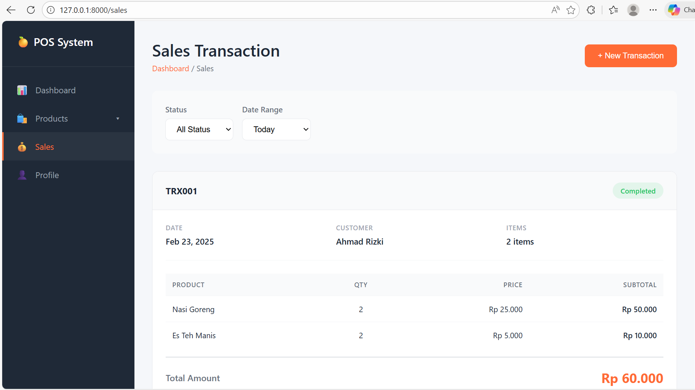

# Laporan Tugas Jobsheet 02 - PWL 2025/2026


## Fitur Aplikasi

### 1. Halaman Home (Dashboard)
Halaman utama yang menampilkan informasi awal website dengan statistik dan quick actions.

**Route:** `/`

**Controller:** `HomeController@index`

**View:** `resources/views/home.blade.php`

**Screenshot:**


---

### 2. Halaman Products
Menampilkan daftar produk berdasarkan kategori dengan menggunakan route prefix.

#### Kategori yang tersedia:
1. **Food & Beverage**
   - Route: `/category/food-beverage`
   - Screenshot: 

2. **Beauty & Health**
   - Route: `/category/beauty-health`
   - Screenshot: 

3. **Home Care**
   - Route: `/category/home-care`
   - Screenshot: 

4. **Baby & Kid**
   - Route: `/category/baby-kid`
   - Screenshot: 

**Controller:** `ProductController@category`

**View:** `resources/views/products/category.blade.php`

---

### 3. Halaman User Profile
Menampilkan profil pengguna dengan route parameter (id dan name).

**Route:** `/user/{id}/name/{name}`

**Contoh:** `/user/1/name/Admin`

**Controller:** `UserController@profile`

**View:** `resources/views/user/profile.blade.php`

**Screenshot:**


---

### 4. Halaman Penjualan (Sales Transaction)
Menampilkan daftar transaksi penjualan POS.

**Route:** `/sales`

**Controller:** `SalesController@index`

**View:** `resources/views/sales/index.blade.php`

**Screenshot:**



---

## Struktur Project

### Controllers
```
app/Http/Controllers/
├── HomeController.php         # Controller untuk halaman home
├── ProductController.php      # Controller untuk halaman products
├── UserController.php         # Controller untuk halaman user profile
└── SalesController.php        # Controller untuk halaman sales
```

### Routes
```php
// File: routes/web.php

// Halaman Home
Route::get('/', [HomeController::class, 'index']);

// Halaman Products dengan route parameter
Route::get('/category/{category}', [ProductController::class, 'category']);

// Halaman User dengan route param
Route::get('/user/{id}/name/{name}', [UserController::class, 'profile']);

// Halaman Penjualan
Route::get('/sales', [SalesController::class, 'index']);
```

### Views
```
resources/views/
├── layout.blade.php              # Layout utama dengan sidebar
├── home.blade.php                # View halaman home/dashboard
├── products/
│   └── category.blade.php        # View halaman kategori produk
├── user/
│   └── profile.blade.php         # View halaman user profile
└── sales/
    └── index.blade.php           # View halaman sales transaction
```


