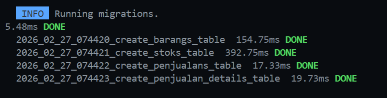
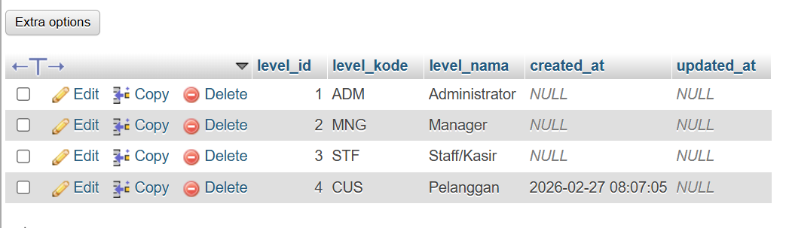
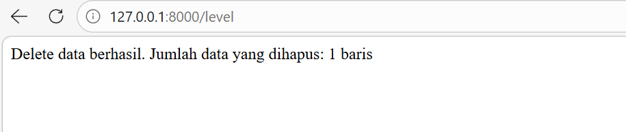
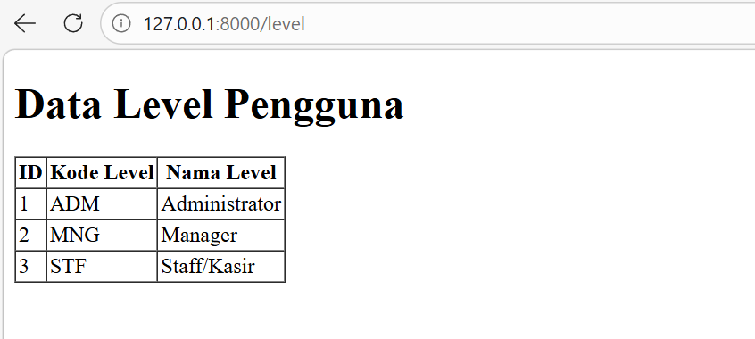
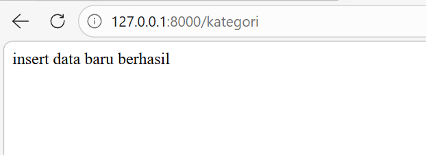
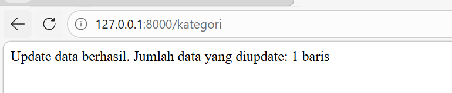
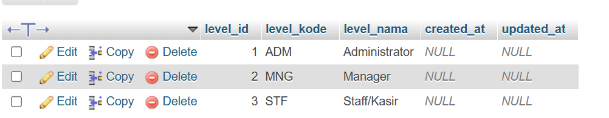
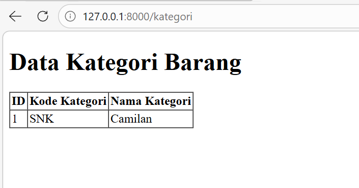

# Laporan Tugas Jobsheet 03 - PWL 2025/2026

## Praktikum 2.1 - Pembuatan File Migrasi Tanpa Relasi

### Langkah-Langkah

**1. Membuat file migrasi untuk tabel m_level**
```bash
php artisan make:migration create_m_level_table
```

**2. Modifikasi file migrasi m_level**

Menambahkan kolom:
- `level_id` (Primary Key, Auto Increment)
- `level_kode` (String)
- `level_nama` (String)
- `timestamps` (created_at, updated_at)

**3. Menjalankan migrasi**
```bash
php artisan migrate
```



**4. Membuat tabel m_kategori dan m_supplier**

Dengan cara yang sama, dibuat file migrasi untuk m_kategori dan m_supplier.

**Hasil:**
✅ Tabel m_level, m_kategori, dan m_supplier berhasil dibuat di database

---

## Praktikum 2.2 - Pembuatan File Migrasi Dengan Relasi

**1. Membuat file migrasi untuk tabel m_user**

```bash
php artisan make:migration create_m_user_table
```

**2. Modifikasi file migrasi m_user**

Menambahkan foreign key yang mereferensi ke tabel m_level:
- Kolom `level_id` dengan tipe `unsignedBigInteger`
- Foreign key constraint: `$table->foreign('level_id')->references('level_id')->on('m_level')`

**3. Menjalankan migrasi**

```bash
php artisan migrate
```

**4. Membuat tabel dengan foreign key lainnya**

Dibuat file migrasi untuk tabel-tabel berikut:

**1. m_barang**
- Foreign key ke m_kategori
- Foreign key ke m_supplier

**2. t_penjualan**
- Foreign key ke m_user

**3. t_stok**
- Foreign key ke m_barang
- Foreign key ke m_user

**4. t_penjualan_detail**
- Foreign key ke t_penjualan
- Foreign key ke m_barang

**Hasil:**
✅ Semua tabel dengan relasi foreign key berhasil dibuat
✅ Relasi antar tabel terbentuk dengan benar

---

## Praktikum 3 - Membuat File Seeder

**Membuat file seeder:**
```bash
php artisan make:seeder NamaSeeder
```

**Menjalankan seeder:**
```bash
php artisan db:seed --class=NamaSeeder
```

**1. Membuat LevelSeeder**

```bash
php artisan make:seeder LevelSeeder
```

Modifikasi file LevelSeeder di dalam method `run()` untuk memasukkan data level (Admin, Manager, Staff).

**2. Menjalankan LevelSeeder**

```bash
php artisan db:seed --class=LevelSeeder
```

**3. Membuat UserSeeder**

```bash
php artisan make:seeder UserSeeder
```

**4. Menjalankan UserSeeder**

```bash
php artisan db:seed --class=UserSeeder
```

**5. Membuat seeder untuk tabel lainnya**

| No | Nama Tabel | Jumlah Data | Keterangan |
|----|------------|-------------|------------|
| 1 | m_kategori | 5 | 5 kategori barang |
| 2 | m_supplier | 3 | 3 supplier barang |
| 3 | m_barang | 15 | 15 barang berbeda (5 barang/supplier) |
| 4 | t_stok | 15 | Stok untuk 15 barang |
| 5 | t_penjualan | 10 | 10 transaksi penjualan |
| 6 | t_penjualan_detail | 30 | 3 barang untuk setiap transaksi penjualan |

**Hasil:**
✅ Semua seeder berhasil dibuat dan dijalankan

---

## Praktikum 4 - Implementasi DB Facade

**1. Membuat LevelController**

```bash
php artisan make:controller LevelController
```

**2. Menambahkan route**

```php
Route::get('/level', [LevelController::class, 'index']);
```

**3. Insert data dengan DB::insert()**

```php
DB::insert('insert into m_level(level_kode, level_nama) values(?, ?)', ['CUS', 'Pelanggan']);
```



**4. Update data dengan DB::update()**

```php
$row = DB::update('update m_level set level_nama = ? where level_kode = ?', ['Customer', 'CUS']);
```

**5. Delete data dengan DB::delete()**

```php
$row = DB::delete('delete from m_level where level_kode = ?', ['CUS']);
```



**6. Select data dengan DB::select()**

```php
$data = DB::select('select * from m_level');
return view('level', ['data' => $data]);
```

**7. Membuat view level.blade.php**

File view dibuat di `resources/views/level.blade.php`



**Hasil:**
✅ Operasi INSERT, UPDATE, DELETE berhasil dilakukan
✅ Data berhasil ditampilkan di view

---

## Praktikum 5 - Implementasi Query Builder

**1. Membuat KategoriController**

```bash
php artisan make:controller KategoriController
```

**2. Menambahkan route**

```php
Route::get('/kategori', [KategoriController::class, 'index']);
```

**3. Insert data**

```php
DB::table('m_kategori')->insert([
    'kategori_kode' => 'SNK',
    'kategori_nama' => 'Snack/Makanan Ringan'
]);
```



**4. Update data**

```php
$row = DB::table('m_kategori')
    ->where('kategori_kode', 'SNK')
    ->update(['kategori_nama' => 'Camilan']);
```



**5. Delete data**

```php
$row = DB::table('m_kategori')
    ->where('kategori_kode', 'SNK')
    ->delete();
```



**6. Select data**

```php
$data = DB::table('m_kategori')->get();
return view('kategori', ['data' => $data]);
```

**7. Membuat view kategori.blade.php**



**Hasil:**
✅ Operasi CRUD berhasil dilakukan dengan Query Builder
✅ Data berhasil ditampilkan di view

---

## Praktikum 6 - Implementasi Eloquent ORM

**1. Membuat model UserModel**

```bash
php artisan make:model UserModel
```

**2. Modifikasi UserModel**

```php
class UserModel extends Model
{
    protected $table = 'm_user';
    protected $primaryKey = 'user_id';
    protected $fillable = ['level_id', 'username', 'nama', 'password'];
}
```

**3. Menambahkan route**

```php
Route::get('/user', [UserController::class, 'index']);
```

**4. Membuat UserController**

```bash
php artisan make:controller UserController
```

**5. Insert data dengan Eloquent**

```php
$data = [
    'level_id' => 2,
    'username' => 'manager_tiga',
    'nama' => 'Manager 3',
    'password' => Hash::make('12345')
];
UserModel::create($data);
```

Hasil: Data baru berhasil ditambahkan ke tabel m_user

**6. Update data dengan Eloquent**

```php
$data = [
    'nama' => 'Pelanggan Pertama'
];
UserModel::where('username', 'customer-1')->update($data);
```

**7. Menampilkan data dengan Eloquent**

```php
$user = UserModel::all();
return view('user', ['data' => $user]);
```

**8. Membuat view user.blade.php**

File view dibuat untuk menampilkan data user dalam format tabel.

**9. Menampilkan data spesifik**

Find by Primary Key:
```php
$user = UserModel::find(1);
```

Find dengan Where:
```php
$user = UserModel::where('level_id', 1)->first();
```

Find dengan firstOr:
```php
$user = UserModel::firstOr(['nama', 'username'], function() {
    abort(404);
});
```

**Hasil:**
✅ Data berhasil di-insert, update, dan ditampilkan menggunakan Eloquent ORM
