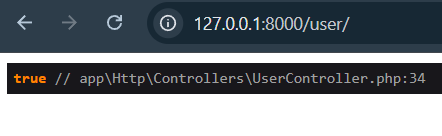
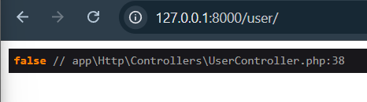
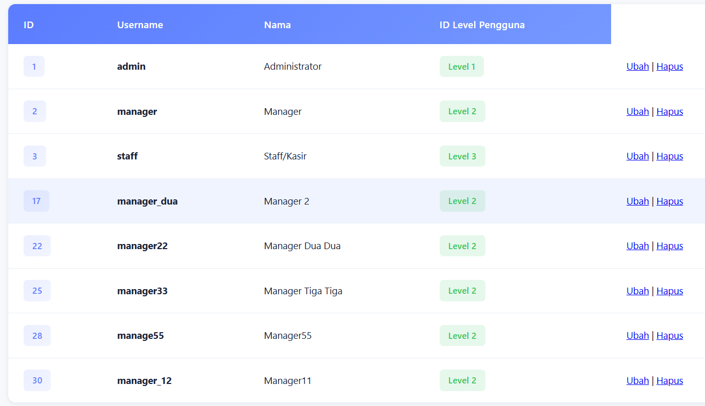
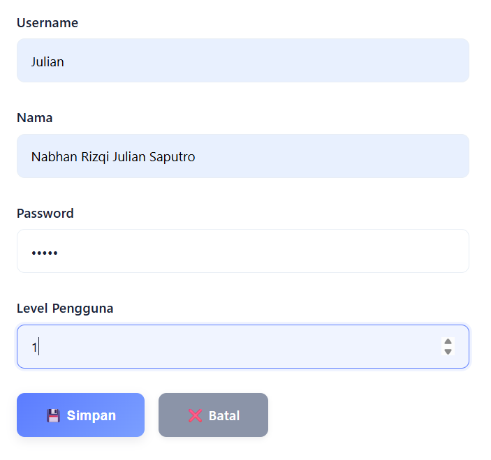
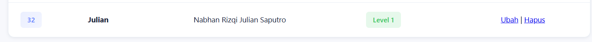
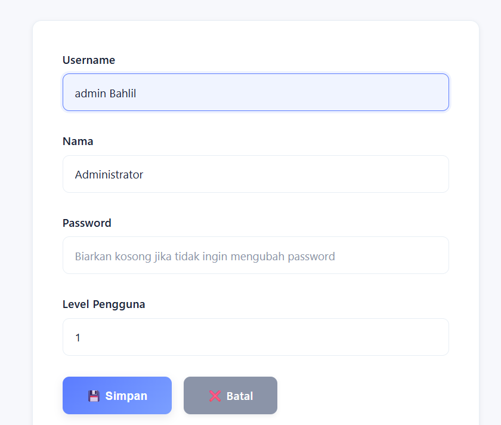
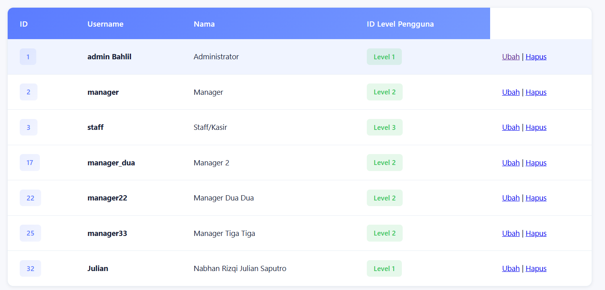
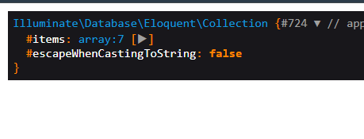
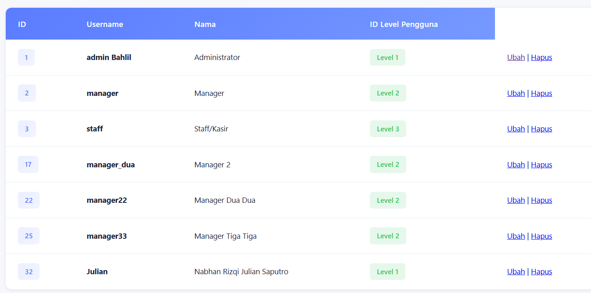
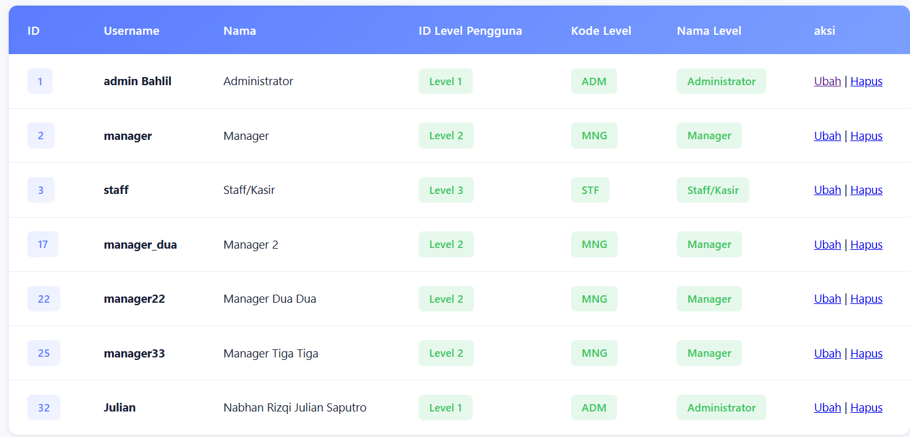

# Laporan Tugas Jobsheet 04 - Eloquent ORM

## Praktikum 1 - $fillable

### Langkah-Langkah

**1. Menambahkan atribut $fillable pada UserModel**

Mendaftarkan kolom yang diizinkan untuk diisi melalui mass assignment.

```php
class UserModel extends Model
{
    use HasFactory;
    protected $table = 'm_user';
    protected $primaryKey = 'user_id';
    
    protected $fillable = ['level_id', 'username', 'nama', 'password'];
}
```

**2. Insert Data di UserController**

Menambahkan data baru menggunakan method create().

```php
public function index()
{
    $data = [
        'level_id' => 2,
        'username' => 'manager_dua',
        'nama' => 'Manager 2',
        'password' => Hash::make('12345')
    ];
    UserModel::create($data);

    $user = UserModel::all();
    return view('user', ['data' => $user]);
}
```


**3. Modifikasi atribut $fillable**

Menghapus 'password' dari $fillable dan mengubah $data untuk melihat efek pembatasan Eloquent.

```php
protected $fillable = ['level_id', 'username', 'nama'];
```


**Hasil & Pengamatan:**
✅ Atribut $fillable bertindak sebagai pengaman (whitelist). Kolom yang tidak terdaftar di dalamnya akan otomatis diabaikan oleh Eloquent saat operasi insert/update massal dilakukan.

---

## Praktikum 2.1 - Retrieving Single Models

### Langkah-Langkah

**1. Menggunakan find()**

Mengambil data berdasarkan Primary Key.

```php
$user = UserModel::find(1);
```


**2. Menggunakan where()->first()**

Mengambil data pertama yang cocok dengan kondisi.

```php
$user = UserModel::where('level_id', 1)->first();
```


**3. Menggunakan firstWhere()**

Penulisan lebih singkat untuk where()->first().

```php
$user = UserModel::firstWhere('level_id', 1);
```


**4. Menggunakan findOr()**

Mengambil data tunggal atau menjalankan callback fungsi (misal: abort(404)) jika data tidak ditemukan.

```php
$user = UserModel::findOr(20, ['username', 'nama'], function () {
    abort(404);
});
```


**Hasil & Pengamatan:**
✅ Method find() cocok untuk pencarian berdasarkan primary key
✅ where()->first() dan firstWhere() memberikan fleksibilitas pencarian dengan kondisi custom
✅ findOr() memungkinkan error handling tanpa exception otomatis

---

## Praktikum 2.2 - Not Found Exceptions

### Langkah-Langkah

**1. Menggunakan findOrFail()**

```php
$user = UserModel::findOrFail(1);
```


**2. Menggunakan firstOrFail()**

```php
$user = UserModel::where('username', 'manager9')->firstOrFail();
```


**Hasil & Pengamatan:**
✅ Jika rekaman data tidak ditemukan, method ini otomatis melemparkan ModelNotFoundException
✅ Exception otomatis merender halaman error 404 tanpa perlu callback manual
✅ Berguna untuk early validation pada operasi update dan delete

---

## Praktikum 2.3 - Retrieving Aggregates

### Langkah-Langkah

**1. Menghitung jumlah data dengan count()**

```php
$user = UserModel::where('level_id', 2)->count();
dd($user);
```


**2. Menampilkan agregat di View**

```blade
<table border="1" cellpadding="2" cellspacing="0">
    <tr>
        <th>Jumlah Pengguna</th>
    </tr>
    <tr>
        <td>{{ $data }}</td>
    </tr>
</table>
```


**Hasil & Pengamatan:**
✅ Fungsi agregat (count, max, sum) mengembalikan nilai skalar berupa angka secara langsung
✅ Tidak mengembalikan instance model Eloquent
✅ Efisien untuk operasi statistik dan reporting

---

## Praktikum 2.4 - Retrieving or Creating Models

### Langkah-Langkah

**1. Menggunakan firstOrCreate()**

Mengambil data yang cocok. Jika tidak ada, langsung dibuat dan disimpan ke database.

```php
$user = UserModel::firstOrCreate(
    ['username' => 'manager22'],
    ['nama' => 'Manager Dua Dua', 'password' => Hash::make('12345'), 'level_id' => 2]
);
```


**2. Menggunakan firstOrNew()**

Membuat instance model baru di memori jika tidak ditemukan, namun belum tersimpan ke database. Membutuhkan pemanggilan save().

```php
$user = UserModel::firstOrNew(
    'username' => 'manager33',
    'nama' => 'Manager Tiga Tiga', 
    'password' => Hash::make('12345'), 
    'level_id' => 2
);
$user->save();
```


**Hasil & Pengamatan:**
✅ firstOrCreate() langsung menyimpan ke database jika data tidak ditemukan
✅ firstOrNew() memberikan kontrol lebih dengan membuat instance terlebih dahulu sebelum save()
✅ Keduanya berguna untuk menghindari duplikasi data

---

## Praktikum 2.5 - Attribute Changes

### Langkah-Langkah

**1. Mengecek modifikasi sebelum disave (isDirty & isClean)**

```php
$user->username = 'manager56';
$user->isDirty(); // true
$user->isClean(); // false
dd($user->isDirty());
```


**2. Mengecek modifikasi sesudah disave (wasChanged)**

```php
$user->save();
$user->wasChanged(); // true
$user->wasChanged('username'); // true
$user->wasChanged(['username','level_id']); // true
$user->wasChanged('nama'); // false
dd($user->wasChanged(['nama','username'])); // true
```



**Hasil & Pengamatan:**
✅ isDirty() mengecek apakah ada perubahan di memori yang belum disimpan
✅ wasChanged() mengecek data apa yang benar-benar berhasil disimpan di database
✅ Berguna untuk validasi dan audit trail pada request lifecycle

---

## Praktikum 2.6 - Create, Read, Update, Delete (CRUD)

### Langkah-Langkah

**1. Read - Menampilkan Data User**

Menggunakan UserModel::all() dan looping data dalam tabel HTML.

```php
public function index()
{
    $user = UserModel::all();
    return view('user', ['data' => $user]);
}
```


**2. Create - Tambah Data User**

Membuat file view form user_tambah.blade.php dan menangani logic POST di controller.

```php
public function tambah_simpan(Request $request)
{
    UserModel::create([
        'username' => $request->username,
        'nama' => $request->nama,
        'password' => Hash::make($request->password),
        'level_id' => $request->level_id
    ]);
    return redirect('/user');
}
```




**3. Update - Ubah Data User**

Mengambil data lama melalui ID dengan find(), meletakkannya di value form user_ubah.blade.php, dan menangani method PUT.

```php
public function ubah_simpan(Request $request, $id)
{
    $user = UserModel::find($id);
    $user->username = $request->username;
    $user->nama = $request->nama;
    $user->password = Hash::make($request->password);
    $user->level_id = $request->level_id;
    $user->save();
    return redirect('/user');
}
```




**4. Delete - Hapus Data User**

Menghapus data menggunakan model.

```php
public function hapus($id)
{
    $user = UserModel::find($id);
    $user->delete();
    return redirect('/user');
}
```




**Hasil & Pengamatan:**
✅ Operasi CRUD lengkap dapat dilakukan dengan Eloquent ORM
✅ Code lebih clean dan readable dibanding raw SQL
✅ Built-in mass assignment protection melalui $fillable

---

## Praktikum 2.7 - Relationships

### Langkah-Langkah

**1. Relasi BelongsTo pada UserModel**

Mendaftarkan relasi karena tabel m_user adalah child dari m_level (memiliki foreign key level_id).

```php
<?php

namespace App\Models;

use Illuminate\Database\Eloquent\Model;
use Illuminate\Database\Eloquent\Relations\BelongsTo;

class UserModel extends Model
{
    use HasFactory;
    protected $table = 'm_user';
    protected $primaryKey = 'user_id';
    
    protected $fillable = ['level_id', 'username', 'nama', 'password'];

    public function level(): BelongsTo
    {
        return $this->belongsTo(LevelModel::class, 'level_id', 'level_id');
    }
}
```



**2. Eager Loading pada UserController**

Menggunakan method with() agar eksekusi query lebih efisien dan menghindari isu N+1 Query.

```php
public function index()
{
    $user = UserModel::with('level')->get();
    return view('user', ['data' => $user]);
}
```


**3. Menampilkan Data Relasi pada View**

Memanggil properti level dari object user secara langsung.

```blade
<table border="1" cellpadding="2" cellspacing="0">
    <thead>
        <tr>
            <th>ID</th>
            <th>Username</th>
            <th>Nama</th>
            <th>Kode Level</th>
            <th>Nama Level</th>
            <td>aksi
        </tr>
    </thead>
    <tbody>
        @foreach($data as $d)
        <tr>
            <td>{{ $d->user_id }}</td>
            <td>{{ $d->username }}</td>
            <td>{{ $d->nama }}</td>
            <td>{{ $d->level->level_kode }}</td>
            <td>{{ $d->level->level_nama }}</td>
        </tr>
        @endforeach
    </tbody>
</table>
```



**Hasil & Pengamatan:**
✅ Eloquent sangat mempermudah pengambilan data berelasi dengan merangkum join SQL ke dalam akses objek property chaining
✅ Eager loading dengan with() mencegah isu N+1 Query pada looping data
✅ Akses relasi menjadi semudah mengakses property object PHP biasa
✅ Code lebih intuitif dan maintainable dibanding raw SQL JOIN

---

## Kesimpulan

Eloquent ORM menyediakan abstraksi yang powerful untuk operasi database:
- ✅ Mass assignment protection dengan $fillable
- ✅ Berbagai cara untuk retrieve data (find, where, aggregate)
- ✅ Error handling built-in dengan findOrFail()
- ✅ Automatic create/update/delete operations
- ✅ Relationship management yang elegant
- ✅ Query optimization dengan eager loading
- ✅ State tracking dengan isDirty/wasChanged

Dengan menggunakan Eloquent ORM, developer dapat menulis code yang lebih clean, maintainable, dan less prone to SQL injection attacks.
