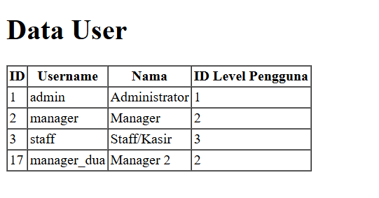
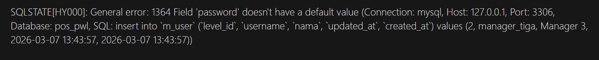
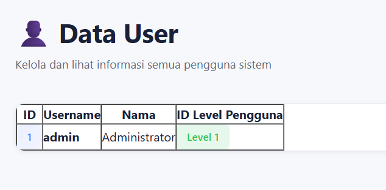
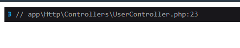
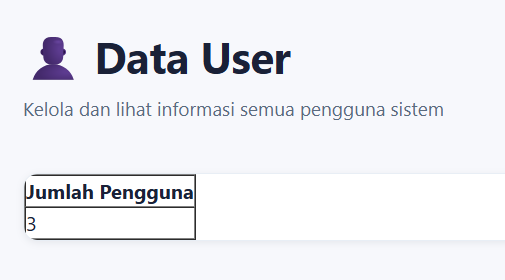
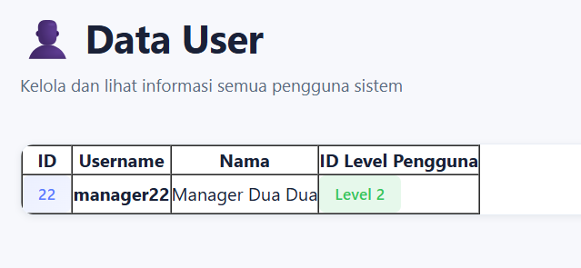
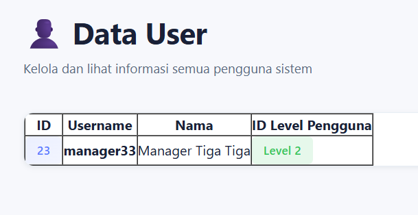

# Laporan Tugas Jobsheet 04 - Eloquent ORM

## Praktikum 1 - $fillable

### Langkah-Langkah

**1. Menambahkan atribut $fillable pada UserModel**

Mendaftarkan kolom yang diizinkan untuk diisi melalui mass assignment.

```php
class UserModel extends Model
{
    use HasFactory;
    protected $table = 'm_user';
    protected $primaryKey = 'user_id';
    
    protected $fillable = ['level_id', 'username', 'nama', 'password'];
}
```

**2. Insert Data di UserController**

Menambahkan data baru menggunakan method create().

```php
public function index()
{
    $data = [
        'level_id' => 2,
        'username' => 'manager_dua',
        'nama' => 'Manager 2',
        'password' => Hash::make('12345')
    ];
    UserModel::create($data);

    $user = UserModel::all();
    return view('user', ['data' => $user]);
}
```



**3. Modifikasi atribut $fillable**

Menghapus 'password' dari $fillable dan mengubah $data untuk melihat efek pembatasan Eloquent.

```php
protected $fillable = ['level_id', 'username', 'nama'];
```


**Hasil & Pengamatan:**
✅ Atribut $fillable bertindak sebagai pengaman (whitelist). Kolom yang tidak terdaftar di dalamnya akan otomatis diabaikan oleh Eloquent saat operasi insert/update massal dilakukan.

---

## Praktikum 2.1 - Retrieving Single Models

### Langkah-Langkah

**1. Menggunakan find()**

Mengambil data berdasarkan Primary Key.

```php
$user = UserModel::find(1);
```


**2. Menggunakan where()->first()**

Mengambil data pertama yang cocok dengan kondisi.

```php
$user = UserModel::where('level_id', 1)->first();
```



**3. Menggunakan firstWhere()**

Penulisan lebih singkat untuk where()->first().

```php
$user = UserModel::firstWhere('level_id', 1);
```


**4. Menggunakan findOr()**

Mengambil data tunggal atau menjalankan callback fungsi (misal: abort(404)) jika data tidak ditemukan.

```php
$user = UserModel::findOr(20, ['username', 'nama'], function () {
    abort(404);
});
```


**Hasil & Pengamatan:**
✅ Method find() cocok untuk pencarian berdasarkan primary key
✅ where()->first() dan firstWhere() memberikan fleksibilitas pencarian dengan kondisi custom
✅ findOr() memungkinkan error handling tanpa exception otomatis

---

## Praktikum 2.2 - Not Found Exceptions

### Langkah-Langkah

**1. Menggunakan findOrFail()**

```php
$user = UserModel::findOrFail(1);
```


**2. Menggunakan firstOrFail()**

```php
$user = UserModel::where('username', 'manager9')->firstOrFail();
```


**Hasil & Pengamatan:**
✅ Jika rekaman data tidak ditemukan, method ini otomatis melemparkan ModelNotFoundException
✅ Exception otomatis merender halaman error 404 tanpa perlu callback manual
✅ Berguna untuk early validation pada operasi update dan delete

---

## Praktikum 2.3 - Retrieving Aggregates

### Langkah-Langkah

**1. Menghitung jumlah data dengan count()**

```php
$user = UserModel::where('level_id', 2)->count();
dd($user);
```



**2. Menampilkan agregat di View**

```blade
<table border="1" cellpadding="2" cellspacing="0">
    <tr>
        <th>Jumlah Pengguna</th>
    </tr>
    <tr>
        <td>{{ $data }}</td>
    </tr>
</table>
```



**Hasil & Pengamatan:**
✅ Fungsi agregat (count, max, sum) mengembalikan nilai skalar berupa angka secara langsung
✅ Tidak mengembalikan instance model Eloquent
✅ Efisien untuk operasi statistik dan reporting

---

## Praktikum 2.4 - Retrieving or Creating Models

### Langkah-Langkah

**1. Menggunakan firstOrCreate()**

Mengambil data yang cocok. Jika tidak ada, langsung dibuat dan disimpan ke database.

```php
$user = UserModel::firstOrCreate(
    ['username' => 'manager22'],
    ['nama' => 'Manager Dua Dua', 'password' => Hash::make('12345'), 'level_id' => 2]
);
```



**2. Menggunakan firstOrNew()**

Membuat instance model baru di memori jika tidak ditemukan, namun belum tersimpan ke database. Membutuhkan pemanggilan save().

```php
$user = UserModel::firstOrNew(
    'username' => 'manager33',
    'nama' => 'Manager Tiga Tiga', 
    'password' => Hash::make('12345'), 
    'level_id' => 2
);
$user->save();
```



**Hasil & Pengamatan:**
✅ firstOrCreate() langsung menyimpan ke database jika data tidak ditemukan
✅ firstOrNew() memberikan kontrol lebih dengan membuat instance terlebih dahulu sebelum save()
✅ Keduanya berguna untuk menghindari duplikasi data

---