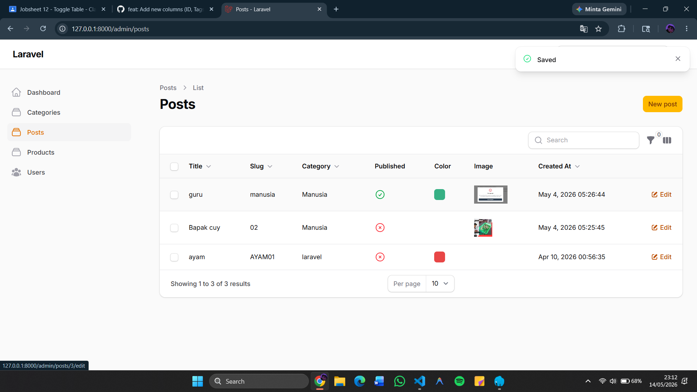
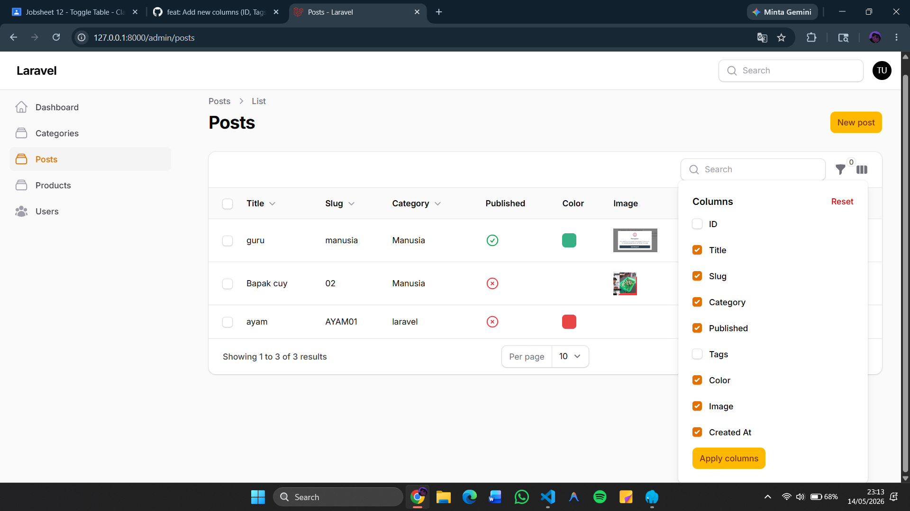
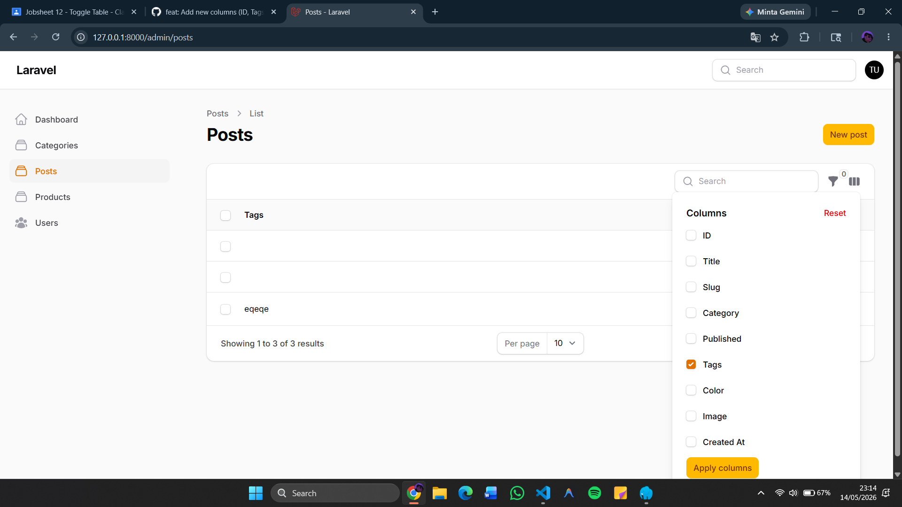

# Laporan Praktikum Pertemuan 12: Implementasi Toggle Column pada Table Filament

**Mata Kuliah:** Pemrograman Web Lanjut  
**Nama Mahasiswa:** Nabhan Rizqi Julian Saputro
**NIM:** 2341720255

---

## 1. Menambahkan Kolom Baru (ID, Tags, & Published)
Pada praktikum ini, kita menambahkan beberapa kolom baru untuk memperkaya informasi pada tabel Post, termasuk penggunaan `IconColumn` untuk tipe data boolean.

**Langkah Kerja:**
Modifikasi `app/Filament/Resources/Posts/Tables/PostsTable.php` untuk menambahkan kolom ID, Tags, dan Published.

```php
TextColumn::make('id')->label('ID'),
TextColumn::make('tags')->label('Tags'),
IconColumn::make('published')
    ->boolean()
    ->label('Published'),
```

**Hasil:**

*Keterangan: Kolom ID, Tags, dan Published berhasil ditambahkan ke dalam tabel.*

---

## 2. Mengaktifkan Fitur Toggleable
Fitur `toggleable()` memungkinkan pengguna untuk memilih kolom mana yang ingin ditampilkan atau disembunyikan melalui menu dropdown di tabel.

**Langkah Kerja:**
Menambahkan method `->toggleable()` pada kolom-kolom yang ada.

```php
TextColumn::make('title')->toggleable(),
IconColumn::make('published')->toggleable(),
```

**Hasil:**

*Keterangan: Muncul icon di pojok kanan atas tabel untuk mengatur visibilitas kolom.*

---

## 3. Menyembunyikan Kolom Secara Default
Untuk menjaga tampilan tetap rapi, kolom yang jarang digunakan (seperti ID atau Tags) diatur agar tersembunyi saat halaman pertama kali dimuat.

**Langkah Kerja:**
Menggunakan parameter `isToggledHiddenByDefault: true`.

```php
TextColumn::make('id')
    ->label('ID')
    ->toggleable(isToggledHiddenByDefault: true),
TextColumn::make('tags')
    ->label('Tags')
    ->toggleable(isToggledHiddenByDefault: true),
```

**Hasil:**

*Keterangan: Kolom ID dan Tags tidak muncul secara default tetapi bisa diaktifkan manual oleh user.*

---

## Analisis & Diskusi

1. **Mengapa toggle column penting pada admin panel?**  
   Ketika sebuah tabel memiliki banyak field (misal 15+ kolom), menampilkan semuanya sekaligus akan merusak layout dan menyulitkan pembacaan data. Toggle column memberikan fleksibilitas kepada admin untuk fokus hanya pada data yang mereka butuhkan saat itu.

2. **Apa perbedaan toggleable() biasa dengan isToggledHiddenByDefault?**  
   - `toggleable()` memberikan **opsi** kepada user untuk menyembunyikan/menampilkan kolom.
   - `isToggledHiddenByDefault: true` menentukan bahwa saat halaman dimuat pertama kali, kolom tersebut dalam keadaan **tersembunyi**.

3. **Mengapa preferensi kolom tetap tersimpan?**  
   Filament menyimpan pilihan user ke dalam session browser. Hal ini memastikan bahwa pengalaman pengguna tetap konsisten (tidak perlu menyembunyikan kolom yang sama berulang kali setiap kali refresh halaman).

4. **Kapan sebaiknya kolom disembunyikan secara default?**  
   Kolom sebaiknya disembunyikan secara default jika:
   - Data bersifat teknis (seperti ID, UUID, atau timestamps detail).
   - Data terlalu panjang (seperti deskripsi lengkap atau tags yang banyak).
   - Data hanya dibutuhkan untuk keperluan audit sesekali.

---

## Kesimpulan
Melalui praktikum ini, kita telah berhasil meningkatkan User Experience (UX) pada Admin Panel dengan fitur Toggle Column. Tabel menjadi lebih bersih dan fleksibel untuk berbagai kebutuhan monitoring data Post.
