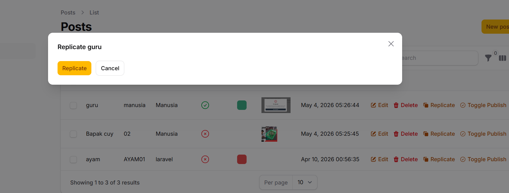
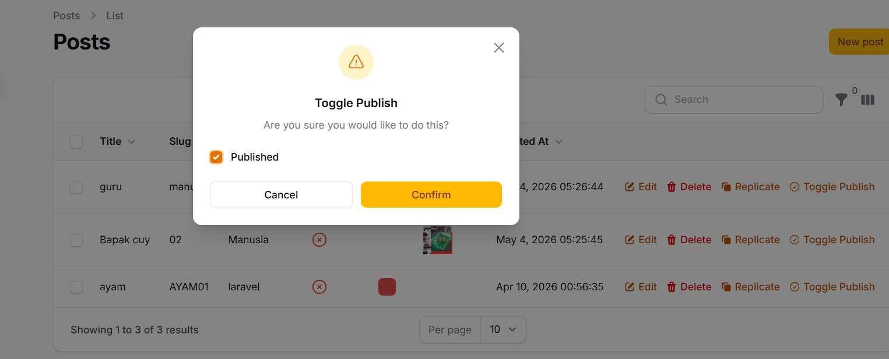
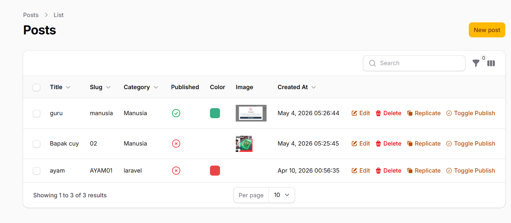

# Laporan Praktikum Pertemuan 13: Implementasi Table Actions & Custom Action di Filament

**Mata Kuliah:** Pemrograman Web Lanjut  
**Nama Mahasiswa:** Nabhan Rizqi Julian saputro
**NIM:** 2341720255

---

## 1. Menambahkan Delete Action
Fitur Delete Action memungkinkan pengguna untuk menghapus record langsung dari tabel tanpa perlu masuk ke halaman edit.

**Langkah Kerja:**
Buka file `app/Filament/Resources/Posts/Tables/PostsTable.php` dan tambahkan import dan action:

```php
use Filament\Actions\DeleteAction;

->recordActions([
    EditAction::make(),
    DeleteAction::make(),
])
```

**Hasil:**delete-action

*Keterangan: Tombol Delete muncul di baris tabel dengan icon sampah merah.*

---

## 2. Menambahkan Replicate Action
Fitur Replicate memungkinkan duplikasi data post secara instan dengan semua field yang sama.

**Langkah Kerja:**
```php
use Filament\Actions\ReplicateAction;

->recordActions([
    EditAction::make(),
    DeleteAction::make(),
    ReplicateAction::make(),
])
```

**Hasil:**

*Keterangan: Tombol Replicate memungkinkan menyalin post existing untuk membuat post baru dengan data yang sama.*

---

## 3. Membuat Custom Action - Toggle Publish Status
Membuat action kustom untuk mengubah status publish/unpublish langsung dari tabel dengan confirmation dialog.

**Langkah Kerja:**

Pertama, tambahkan imports yang diperlukan:

```php
use Filament\Forms\Components\Checkbox;
use Filament\Actions\Action;
```

Kemudian tambahkan custom action pada `recordActions()`:

```php
Action::make('toggle_publish')
    ->label('Toggle Publish')
    ->icon('heroicon-o-check-circle')
    ->color('warning')
    ->requiresConfirmation()
    ->schema([
        Checkbox::make('published')
            ->label('Published')
            ->default(fn($record): bool => $record->published),
    ])
    ->action(function ($record, $data) {
        $record->update(['published' => $data['published']]);
    }),
```

**Penjelasan Kode:**
- `->label()`: Menampilkan nama action di tombol
- `->icon()`: Menambahkan icon dari Heroicons
- `->color()`: Mengatur warna tombol (warning = kuning)
- `->requiresConfirmation()`: Menampilkan dialog konfirmasi sebelum melakukan action
- `->schema()`: Menyediakan form input untuk action
- `->action()`: Logic yang dijalankan ketika user submit form

**Hasil:**

*Keterangan: Dialog konfirmasi dengan checkbox untuk mengubah status publish.*


*Keterangan: User diminta konfirmasi sebelum perubahan status diterapkan.*

---

## 4. Visualisasi Table dengan Semua Actions
Menampilkan keseluruhan tampilan tabel setelah implementasi semua actions.

**Hasil:**

*Keterangan: Tabel Post dengan kolom-kolom dan action buttons (Edit, Delete, Replicate, Toggle Publish) di setiap baris.*

---

## Analisis & Diskusi

1. **Mengapa action di tabel lebih efisien dibanding halaman edit?**  
   Dengan action di tabel, user dapat melakukan operasi CRUD langsung tanpa navigasi keluar dari halaman. Ini menghemat waktu, mengurangi loading page, dan meningkatkan user experience secara signifikan terutama untuk operasi berulang atau batch action.

2. **Apa perbedaan predefined action dan custom action?**  
   - **Predefined Action:** Action bawaan Filament seperti Edit, Delete, Replicate. Mereka sudah mengurus logic kompleks di background.
   - **Custom Action:** Action yang kita buat sendiri untuk kebutuhan spesifik bisnis. Kita dapat menentukan form input, validasi, dan logic update secara manual.

3. **Bagaimana cara menambahkan validasi dalam custom action?**  
   Kita dapat menambahkan rules pada form component di schema:
   ```php
   ->schema([
       Checkbox::make('published')
           ->label('Published')
           ->default(fn($record): bool => $record->published),
       TextInput::make('reason')
           ->label('Reason')
           ->required()
           ->maxLength(255),
   ])
   ```

4. **Kapan kita menggunakan Replicate?**  
   Replicate sangat berguna ketika:
   - Template atau draft post akan dibuat berkali-kali dengan struktur sama
   - Ingin membuat varian dari post existing (copy dan edit sedikit)
   - User ingin membuat backup atau archive post

---

## Kesimpulan
Melalui praktikum ini, kita telah berhasil mengimplementasikan Table Actions yang meningkatkan efisiensi admin panel secara signifikan. Kombinasi predefined actions (Edit, Delete, Replicate) dan custom actions (Toggle Publish) memberikan fleksibilitas dan kontrol penuh kepada admin dalam mengelola data Post.
