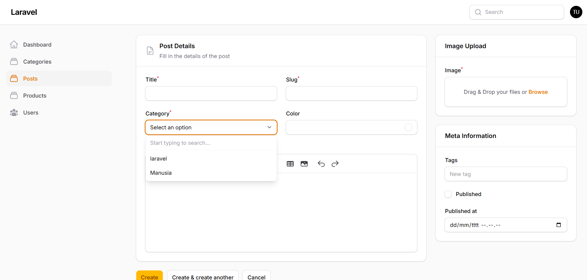
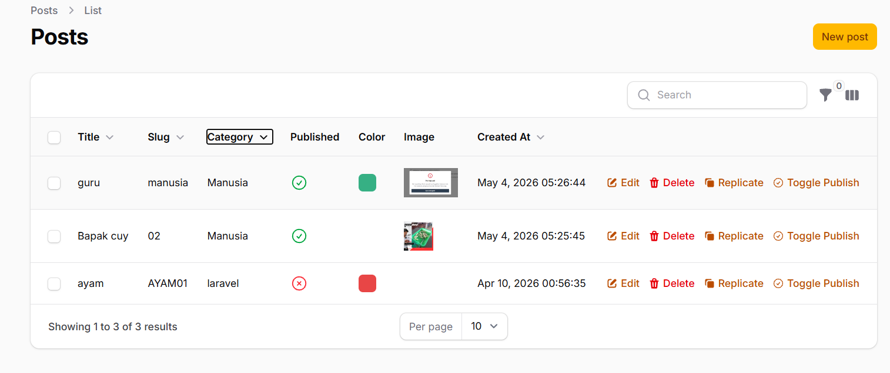
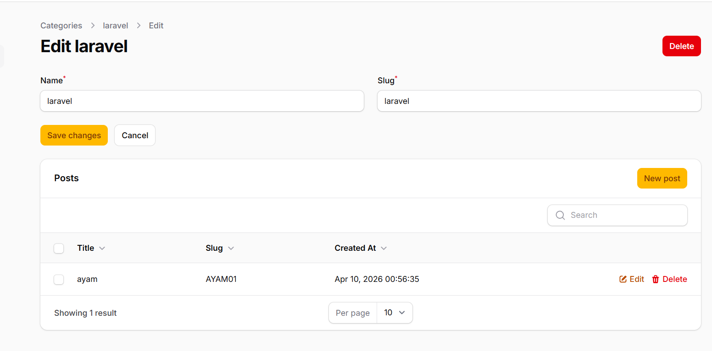
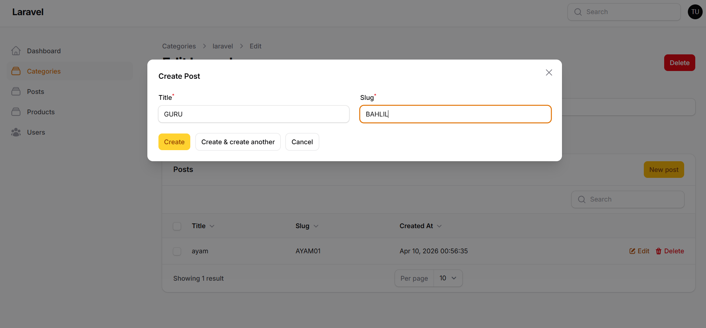

# Laporan Praktikum Pertemuan 14: Implementasi Relationship (HasMany) & Relationship Manager di Filament

**Mata Kuliah:** Pemrograman Web Lanjut  
**Nama Mahasiswa:** Nabhan Rizqi Julian Saputro
**NIM:** 2341720255

---

## 1. Membuat Relasi Category -> Posts pada Model
Menghubungkan model `Category` dengan `Post` menggunakan relasi One-to-Many (`HasMany`) agar data post dapat diakses secara langsung dari kategori yang bersangkutan.

**Langkah Kerja:**
Buka file `app/Models/Category.php` dan tambahkan method `posts()`:

```php
use Illuminate\Database\Eloquent\Relations\HasMany;

public function posts(): HasMany
{
    return $this->hasMany(Post::class);
}
```

*Keterangan: Relasi ini melengkapi relasi `belongsTo()` yang sudah didefinisikan sebelumnya di dalam model `Post.php`.*

---

## 2. Mengimplementasikan Relationship Dropdown & Searchable pada Post Form
Membuat input pilihan kategori pada form Post menjadi dinamis menggunakan relasi Eloquent serta menambahkan fitur pencarian untuk mempermudah pencarian kategori.

**Langkah Kerja:**
Buka file `app/Filament/Resources/Posts/Schemas/PostForm.php` dan sesuaikan komponen `Select`:

```php
use Filament\Forms\Components\Select;

Select::make('category_id')
    ->relationship('category', 'name')
    ->preload()
    ->searchable()
    ->required(),
```

**Hasil:**

*Keterangan: Pilihan kategori kini memuat data secara dinamis dari database dan dapat dicari menggunakan input text.*

---

## 3. Menampilkan Data Kategori pada Post Table
Menampilkan kolom nama kategori yang berelasi dengan post pada tabel utama data Post untuk mempermudah identifikasi kategori post.

**Langkah Kerja:**
Buka file `app/Filament/Resources/Posts/Tables/PostsTable.php` dan tambahkan kolom relasi:

```php
use Filament\Tables\Columns\TextColumn;

TextColumn::make('category.name')
    ->sortable()
    ->searchable()
    ->toggleable(),
```

**Hasil:**

*Keterangan: Kolom Category menampilkan nama kategori dari relasi tabel categories secara dinamis.*

---

## 4. Membuat Relationship Manager pada CategoryResource
Membuat Relationship Manager untuk mengelola relasi posts langsung dari halaman edit Category tanpa harus berpindah ke menu Posts.

**Langkah Kerja:**
1. Jalankan command pembuatan relation manager:
```bash
php artisan make:filament-relation-manager CategoryResource posts title --resource-namespace=App\Filament\Resources\Categories
```
2. Konfigurasikan form dan table di `app/Filament/Resources/Categories/CategoryResource/RelationManagers/PostsRelationManager.php`:

```php
namespace App\Filament\Resources\Categories\CategoryResource\RelationManagers;

use Filament\Resources\RelationManagers\RelationManager;
use Filament\Schemas\Schema;
use Filament\Forms\Components\TextInput;
use Filament\Tables\Table;
use Filament\Tables\Columns\TextColumn;
use Filament\Actions\CreateAction;
use Filament\Actions\EditAction;
use Filament\Actions\DeleteAction;
use Filament\Actions\BulkActionGroup;
use Filament\Actions\DeleteBulkAction;

class PostsRelationManager extends RelationManager
{
    protected static string $relationship = 'posts';

    public function form(Schema $schema): Schema
    {
        return $schema
            ->components([
                TextInput::make('title')
                    ->required()
                    ->maxLength(255),
                TextInput::make('slug')
                    ->required()
                    ->maxLength(255),
            ]);
    }

    public function table(Table $table): Table
    {
        return $table
            ->recordTitleAttribute('title')
            ->columns([
                TextColumn::make('title')
                    ->sortable()
                    ->searchable(),
                TextColumn::make('slug')
                    ->sortable()
                    ->searchable(),
                TextColumn::make('created_at')
                    ->label('Created At')
                    ->dateTime()
                    ->sortable(),
            ])
            ->filters([
                //
            ])
            ->headerActions([
                CreateAction::make(),
            ])
            ->actions([
                EditAction::make(),
                DeleteAction::make(),
            ])
            ->bulkActions([
                BulkActionGroup::make([
                    DeleteBulkAction::make(),
                ]),
            ]);
    }
}
```

3. Hubungkan Relation Manager tersebut di `app/Filament/Resources/Categories/CategoryResource.php`:

```php
use App\Filament\Resources\Categories\CategoryResource\RelationManagers\PostsRelationManager;

public static function getRelations(): array
{
    return [
        PostsRelationManager::class,
    ];
}
```

**Hasil:**

*Keterangan: Daftar post yang termasuk ke dalam kategori yang sedang diedit muncul di bagian bawah form edit kategori.*

---

## 5. Membuat/Mengelola Post Baru dari Category (Relationship Manager)
Menguji pembuatan data Post baru langsung dari halaman Category Edit menggunakan tombol Create di dalam Relationship Manager.

**Hasil:**

*Keterangan: Form pembuatan post terbuka dalam modal di mana foreign key (category_id) terisi secara otomatis sesuai dengan kategori yang sedang aktif.*

---

## Analisis & Diskusi

1. **Apa perbedaan `relationship()` dengan `options()` pada Filament?**  
   - `relationship()` menghubungkan field input secara langsung dengan relasi database Eloquent. Filament akan mengurus query pemuatan data (termasuk eager loading) dan penyimpanan foreign key secara otomatis di background.
   - `options()` mewajibkan kita mendefinisikan daftar pilihan secara manual dalam bentuk array key-value statis atau hasil pluck query (misal `Category::pluck('name', 'id')`). Ini kurang efisien untuk relasi dinamis karena tidak memiliki integrasi siklus hidup penyimpanan Filament.

2. **Mengapa fitur `searchable()` penting untuk dataset berukuran besar?**  
   Ketika data relasi (kategori/post) mencapai ratusan atau ribuan baris, memuat seluruh data ke dalam dropdown HTML biasa akan membebani RAM server dan menyebabkan browser lag. Fitur `searchable()` mengimplementasikan pencarian dinamis (AJAX) sehingga Filament hanya mengambil data yang cocok dengan kata pencarian pengguna.

3. **Apa fungsi utama dari Relationship Manager pada Filament?**  
   Relationship Manager berfungsi sebagai panel manajemen terintegrasi di mana admin panel dapat melakukan operasi CRUD lengkap (Create, Read, Update, Delete) pada tabel anak (Post) langsung dari halaman induk (Category) tanpa perlu berpindah menu navigasi.

4. **Kapan waktu yang tepat menggunakan relasi `HasMany` dan `BelongsTo`?**  
   - **`HasMany`:** Digunakan di model induk yang memiliki atau menampung banyak data anak (misal: Kategori memiliki banyak Post, sehingga di `Category.php` menggunakan `HasMany`).
   - **`BelongsTo`:** Digunakan di model anak yang menyimpan kolom foreign key rujukan induknya (misal: Post merujuk pada Kategori tertentu melalui `category_id`, sehingga di `Post.php` menggunakan `BelongsTo`).

---

## Kesimpulan
Melalui praktikum Pertemuan 14 ini, kita berhasil mengimplementasikan relasi database `HasMany` pada Filament admin panel. Dengan mengaktifkan `relationship()` yang `searchable` pada form select, kita meningkatkan kualitas input data. Terlebih lagi, penggunaan `Relationship Manager` secara signifikan mempermudah pengelolaan data berelasi langsung dari halaman detail/edit model induk, menciptakan user experience yang jauh lebih efisien, terintegrasi, dan profesional.
