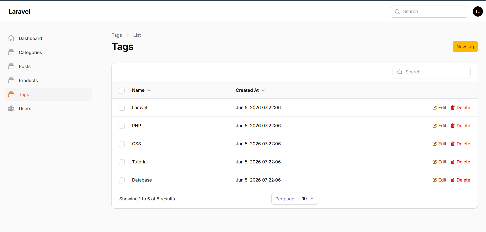
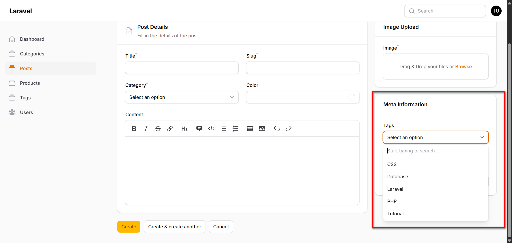
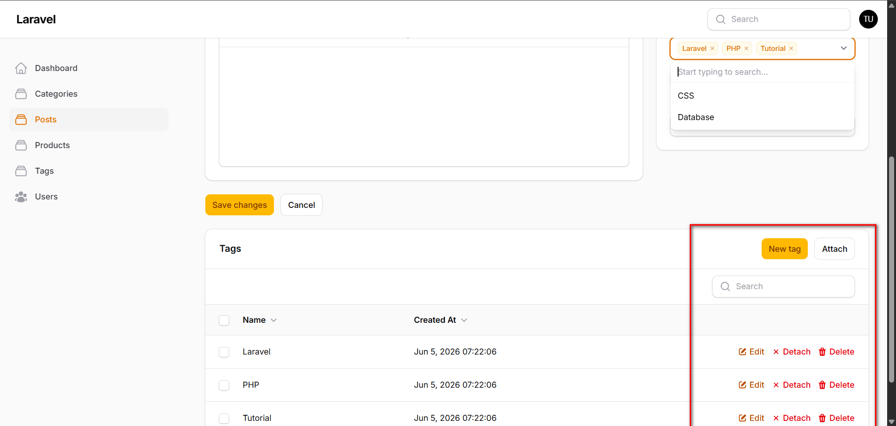

# Laporan Praktikum Pertemuan 15: Implementasi Many-to-Many Relationship & Pivot Table di Filament

**Mata Kuliah:** Pemrograman Web Lanjut  
**Nama Mahasiswa:** Nabhan Rizqi Julian Saputro
**NIM:** 2341720255

---

## 1. Rollback & Modifikasi Migration (Hapus JSON Tags, Buat Tabel Tags & Pivot)
Mengubah struktur database dari penyimpanan tag berformat JSON di kolom tabel posts menjadi relasi Many-to-Many ternormalisasi menggunakan tabel pivot `post_tag`.

**Langkah Kerja:**
1. Rollback migrasi terakhir untuk menghapus tabel posts dan products:
```bash
php artisan migrate:rollback --step=2
```
2. Modifikasi file migration `database/migrations/2026_03_14_113424_create_posts_table.php` dengan menghapus kolom `$table->json('tags')` dan menambahkan definisi tabel `tags` serta pivot `post_tag`:

```php
        Schema::create('posts', function (Blueprint $table) {
            $table->id();
            $table->string('title');
            $table->string('slug');
            $table->integer('category_id');
            $table->string('color')->nullable();
            $table->string('image')->nullable();
            $table->text('body')->nullable();
            $table->boolean('published')->default(false);
            $table->date('published_at')->nullable();
            $table->timestamps();
        });

        Schema::create('tags', function (Blueprint $table) {
            $table->id();
            $table->string('name');
            $table->timestamps();
        });

        Schema::create('post_tag', function (Blueprint $table) {
            $table->foreignId('post_id')->constrained()->cascadeOnDelete();
            $table->foreignId('tag_id')->constrained()->cascadeOnDelete();
            $table->primary(['post_id', 'tag_id']);
        });
```

3. Jalankan kembali migrasi database:
```bash
php artisan migrate
```

---

## 2. Membuat Model Tag & Hubungan BelongsToMany
Mendefinisikan relasi `belongsToMany` pada model `Post` dan `Tag` untuk menghubungkan kedua data menggunakan pivot table `post_tag`.

**Langkah Kerja:**
1. Buat model `Tag` di `app/Models/Tag.php`:
```php
namespace App\Models;

use Illuminate\Database\Eloquent\Model;
use Illuminate\Database\Eloquent\Relations\BelongsToMany;

class Tag extends Model
{
    protected $fillable = ['name'];

    public function posts(): BelongsToMany
    {
        return $this->belongsToMany(Post::class, 'post_tag');
    }
}
```

2. Buka `app/Models/Post.php`, hapus `tags` dari `$fillable` dan `$casts`, lalu tambahkan method `tags()`:
```php
    public function tags()
    {
        return $this->belongsToMany(Tag::class, 'post_tag');
    }
```

---

## 3. Membuat Resource Tag pada Filament
Membuat panel administrasi data Tag lengkap dengan formulir input, tabel daftar data, serta mengarahkan halaman pembuatan/pengeditan langsung kembali ke halaman index.

**Langkah Kerja:**
1. Jalankan command pembuatan resource Tag:
```bash
php artisan make:filament-resource Tags/Tag
```
2. Buat Form Schema di `app/Filament/Resources/Tags/Schemas/TagForm.php`:
```php
namespace App\Filament\Resources\Tags\Schemas;

use Filament\Schemas\Schema;
use Filament\Forms\Components\TextInput;

class TagForm
{
    public static function configure(Schema $schema): Schema
    {
        return $schema
            ->components([
                TextInput::make('name')
                    ->required()
                    ->maxLength(255),
            ]);
    }
}
```

3. Buat Table Schema di `app/Filament/Resources/Tags/Tables/TagsTable.php`:
```php
namespace App\Filament\Resources\Tags\Tables;

use Filament\Actions\BulkActionGroup;
use Filament\Actions\DeleteBulkAction;
use Filament\Actions\EditAction;
use Filament\Actions\DeleteAction;
use Filament\Tables\Table;
use Filament\Tables\Columns\TextColumn;

class TagsTable
{
    public static function configure(Table $table): Table
    {
        return $table
            ->columns([
                TextColumn::make('name')->sortable()->searchable(),
                TextColumn::make('created_at')->label('Created At')->dateTime()->sortable(),
            ])
            ->recordActions([
                EditAction::make(),
                DeleteAction::make(),
            ])
            ->toolbarActions([
                BulkActionGroup::make([
                    DeleteBulkAction::make(),
                ]),
            ]);
    }
}
```

4. Tambahkan override method `getRedirectUrl()` pada `CreateTag.php` dan `EditTag.php` di dalam folder `Pages` agar dialihkan ke index setelah simpan:
```php
    protected function getRedirectUrl(): string
    {
        return $this->getResource()::getUrl('index');
    }
```

**Hasil:**

*Keterangan: Halaman dashboard Tag untuk manajemen data tag master.*

---

## 4. Menggunakan Multiple Select Tag di Form Post
Mengganti input teks manual tags sebelumnya dengan pilihan berganda dinamis yang terhubung ke database.

**Langkah Kerja:**
Buka `app/Filament/Resources/Posts/Schemas/PostForm.php` dan ubah kolom tags menjadi `Select`:

```php
use Filament\Forms\Components\Select;

Select::make('tags')
    ->relationship('tags', 'name')
    ->multiple()
    ->preload(),
```

**Hasil:**

*Keterangan: Input Tags kini berupa dropdown multi-select dengan data dinamis dari tabel tags.*

---

## 5. Mengimplementasikan Tags Relationship Manager di PostResource
Menambahkan panel kelola hubungan tag langsung dari halaman edit Post untuk melakukan aksi *Attach* dan *Detach* hubungan tag.

**Langkah Kerja:**
1. Buat Relation Manager kelas di `app/Filament/Resources/Posts/PostResource/RelationManagers/TagsRelationManager.php`:

```php
namespace App\Filament\Resources\Posts\PostResource\RelationManagers;

use Filament\Resources\RelationManagers\RelationManager;
use Filament\Schemas\Schema;
use Filament\Forms\Components\TextInput;
use Filament\Tables\Table;
use Filament\Tables\Columns\TextColumn;
use Filament\Actions\CreateAction;
use Filament\Actions\EditAction;
use Filament\Actions\DeleteAction;
use Filament\Actions\AttachAction;
use Filament\Actions\DetachAction;
use Filament\Actions\BulkActionGroup;
use Filament\Actions\DeleteBulkAction;
use Filament\Actions\DetachBulkAction;

class TagsRelationManager extends RelationManager
{
    protected static string $relationship = 'tags';

    public function form(Schema $schema): Schema
    {
        return $schema->components([
            TextInput::make('name')->required()->maxLength(255),
        ]);
    }

    public function table(Table $table): Table
    {
        return $table
            ->recordTitleAttribute('name')
            ->columns([
                TextColumn::make('name')->sortable()->searchable(),
                TextColumn::make('created_at')->label('Created At')->dateTime()->sortable(),
            ])
            ->headerActions([
                CreateAction::make(),
                AttachAction::make(),
            ])
            ->actions([
                EditAction::make(),
                DetachAction::make(),
                DeleteAction::make(),
            ])
            ->bulkActions([
                BulkActionGroup::make([
                    DetachBulkAction::make(),
                    DeleteBulkAction::make(),
                ]),
            ]);
    }
}
```

2. Daftarkan Relation Manager tersebut di `app/Filament/Resources/Posts/PostResource.php`:
```php
use App\Filament\Resources\Posts\PostResource\RelationManagers\TagsRelationManager;

public static function getRelations(): array
{
    return [
        TagsRelationManager::class,
    ];
}
```

**Hasil:**

*Keterangan: Panel kelola tag di bagian bawah form edit Post dengan tombol Attach dan Detach.*

---

## Analisis & Diskusi

1. **Apa perbedaan antara relasi `HasMany` dan `Many-to-Many`?**  
   - `HasMany` (One-to-Many) digunakan saat satu record induk memiliki banyak record anak, di mana kolom foreign key disimpan di tabel anak (misal: satu Category memiliki banyak Post).
   - `Many-to-Many` digunakan saat banyak record model A terhubung dengan banyak record model B, sehingga membutuhkan tabel perantara/pivot (misal: satu Post memiliki banyak Tag, dan satu Tag memiliki banyak Post).

2. **Mengapa tabel pivot (pivot table) diperlukan pada relasi Many-to-Many?**  
   Untuk menjaga integritas data dan mematuhi aturan normalisasi database (3NF). Tanpa tabel pivot, kita terpaksa menduplikasi baris atau menyimpan data terformat array/JSON yang menyulitkan join SQL, pencarian data, serta pembuatan indeks yang cepat.

3. **Apa fungsi aksi `attach` dan `detach` pada Filament Admin Panel?**  
   - `Attach`: Menghubungkan record relasi yang sudah ada di database ke record utama dengan menambahkan baris baru di tabel pivot (misal menghubungkan tag existing "Laravel" ke postingan).
   - `Detach`: Memutuskan hubungan tanpa menghapus data master relasi tersebut dari database dengan cara menghapus baris pencatatannya di tabel pivot.

4. **Mengapa penyimpanan data relasi menggunakan kolom JSON dianggap kurang baik?**  
   - Tidak mendukung integritas referensial (foreign key constraints).
   - Query pencarian data berbasis SQL biasa sangat lambat dan kompleks karena database harus melakukan scan teks/dokumen JSON penuh.
   - Operasi update/hapus data parsial di dalam dokumen JSON berisiko tinggi memicu balapan data (race condition).

---
