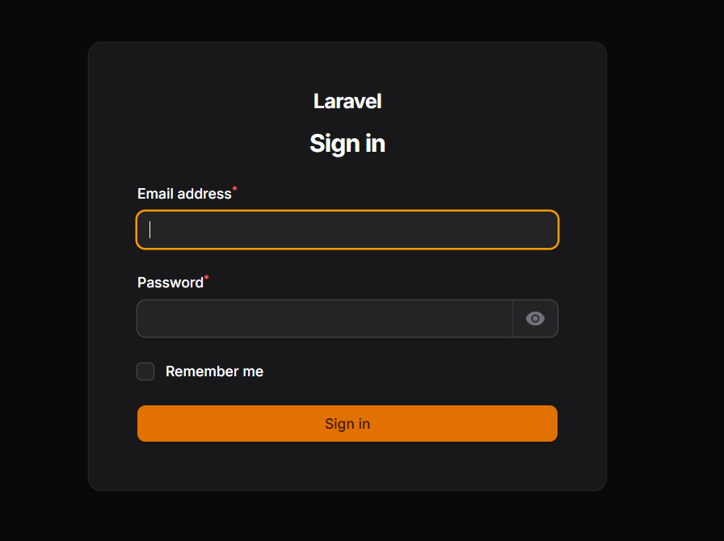
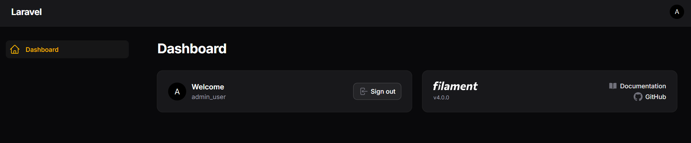
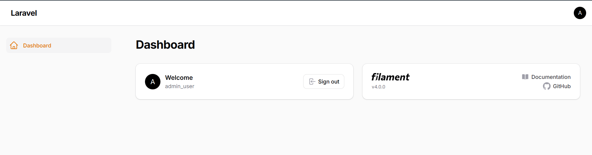

# Laporan Tugas Jobsheet 01 - Filament - PWL 2025/2026

## Analisis & Diskusi

### Pertanyaan

**1. Apa kelebihan Filament dibanding membuat admin panel manual?**
- **Pengembangan Cepat:** Pembuatan CRUD, form, dan tabel sangat efisien karena sudah difasilitasi oleh komponen bawaan, mempercepat waktu rilis.
- **Desain Modern:** Secara default sudah menggunakan TALL stack (Tailwind, Alpine, Laravel, Livewire) sehingga tampilan UI sangat modern tanpa perlu mendesain dari awal.
- **Fitur Lengkap (Out-of-the-box):** Tidak perlu menyusun fitur pencarian, filter, pagination, maupun manajemen relasi tabel secara manual.
- **Ekosistem yang Luas:** Dukungan plugin komunitas dan resmi yang sangat besar (seperti ekspor/impor, chart, manajemen user) untuk menambah fitur dengan mudah.

**2. Mengapa Filament menggunakan Livewire?**
- **Pengalaman Interaktif tanpa SPA:** Livewire memungkinkan tampilan interaktif layaknya Single Page Application (tanpa *full page reload*) menggunakan AJAX, tanpa harus membuat framework frontend terpisah seperti Vue atau React.
- **Pengembangan Murni Backend:** Pengembang cukup menggunakan PHP dan Blade (tanpa harus ahli JavaScript) untuk membuat komponen reaktif, sehingga menjaga alur kerja *developer* Laravel tetap sederhana.
- **Keamanan dan Integrasi Laravel:** Komponen berjalan di sisi server, dapat secara langsung mengakses operasi Eloquent, autentikasi, dan validasi standar Laravel secara aman.

**3. Apa perbedaan SQLite dan MySQL dalam development**
- **Setup & Instalasi:** SQLite berjalan sebagai sebuah file tunggal yang sangat ringan tanpa perlunya server database eksternal (sangat praktis untuk prototyping/testing), sedangkan MySQL butuh server database (seperti Laragon/XAMPP) berserta konfigurasi *user*, *host*, dll.
- **Performa & Koneksi Bersamaan:** Saat proses *development* dasar, SQLite lebih mudah untuk dialihkan antar rekan tim atau komputer tanpa perlu ekspor-impor database. Namun fitur konkurensi SQLite terbatas karena *locking mechanism*, sedangkan MySQL dioptimalkan untuk akses *client-server* massal, sehingga MySQL merupakan standar ketika aplikasi masuk fase produksi (skala aplikasi yang lebih besar).

**4. Apa fungsi Panel Builder?**
- **Kerangka Utama Dashboard:** Merupakan inti (`filament/filament`) dari sistem admin. Panel Builder bertugas merangkai *Resources* (CRUD data), halaman kustom (*Pages*), dan *Widgets* (grafik) menjadi satu tampilan web administrasi terpadu.
- **Pengaturan Konfigurasi Multi-Aktor:** Fitur utama dari Panel Builder adalah kemudahan mengatur konfigurasi panel (*Panel Provider*) untuk kelompok yang berbeda, contohnya membentuk satu panel untuk staf admin dan membentuk satu panel berbeda untuk bagian *customer* di dalam *base* Laravel yang sama tanpa bentrokan rute dan sistem autentikasi.
**

## Tampilan

**Tampilan Login**
 

**Tampilan Dashboard Dark**
 

**Tampilan Dashboard Light**
 

