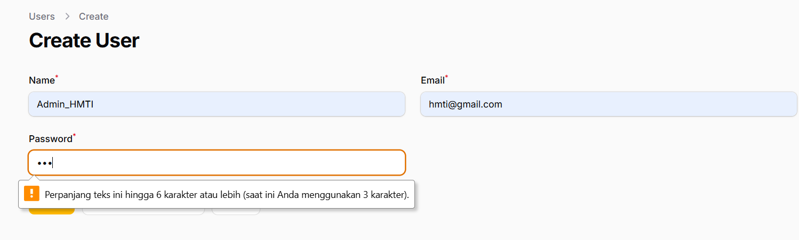
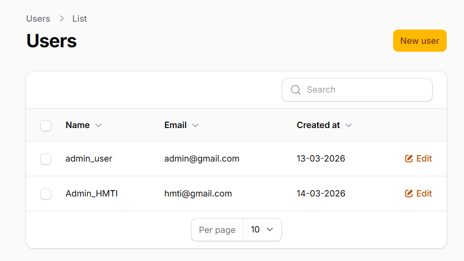

# Laporan Tugas Jobsheet 02 - Filament - PWL 2025/2026

## Analisis & Diskusi

### Pertanyaan

**1. Mengapa Filament dapat membuat CRUD tanpa banyak coding?**
Filament menggunakan pendekatan deklaratif, di mana kita hanya perlu mendefinisikan skema (komponen apa saja yang ingin ditampilkan) melalui kelas PHP. Karena dibangun di atas stack TALL (Tailwind, Alpine.js, Laravel, dan Livewire), Filament secara otomatis menangani *routing*, validasi, manajemen *state*, hingga *rendering* antarmuka (UI) untuk tiap aksi CRUD tanpa memerlukan file HTML, *controller*, dan *request validation* terpisah.

**2. Apa perbedaan Form Schema dan Table Schema?**
- **Form Schema** digunakan untuk mendefinisikan *fields* atau inputan pada halaman Create (membuat data baru) dan Edit (memperbarui data). Area ini mengatur komponen input form, relasi input, layout, dan aturan validasi.
- **Table Schema** digunakan untuk mendefinisikan kolom, aksi tabel (view, edit, delete), serta filter pada halaman List (daftar atau tabel) tempat membaca dan menyortir data dari *database*.

**3. Bagaimana jika kita ingin menambahkan validasi email unik?**
Kita dapat menambahkan *method* `unique()` pada *field* email di dalam Form Schema.
Contoh:
```php
TextInput::make('email')
    ->email()
    ->required()
    ->unique(ignoreRecord: true)
```
Penambahan parameter `ignoreRecord: true` sangat penting agar saat kita mengedit (Update) *record*, sistem operasi pengabaikan alamat email yang sudah ada pada *record* tersebut jika nilainya tidak diubah, sehingga tidak gagal saat memvalidasi *uniqueness*.

**4. Mengapa password tidak perlu kita hash manual?**
Dalam ekosistem Laravel modern yang digabungkan dengan Filament, password biasanya sudah ditangani secara otomatis melalui **Model Casts** pada file Model, misalnya di dalam `User.php` sudah disetel *return* `'password' => 'hashed'`. Selain itu, melalui Filament form, kita juga dapat meng-*hash* *password* via siklus *dehydrate*, contohnya seperti ini saat kita mendefinisikan skema:
```php
TextInput::make('password')
    ->password()
    ->dehydrateStateUsing(fn ($state) => Hash::make($state))
```
Oleh karena mekanisme internal Laravel dan Filament ini, kita tidak perlu memikirkan untuk mengenkripsi nilainya secara mandiri sebelum menyimpan data ke *database*.

## Tampilan

**Tampilan CRUD**
<br>

**Tampilan User**
<br>
