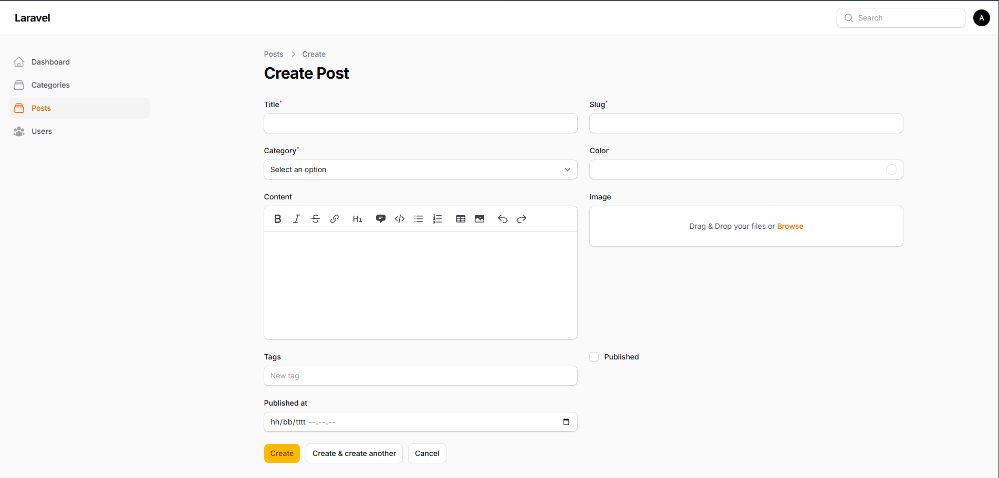
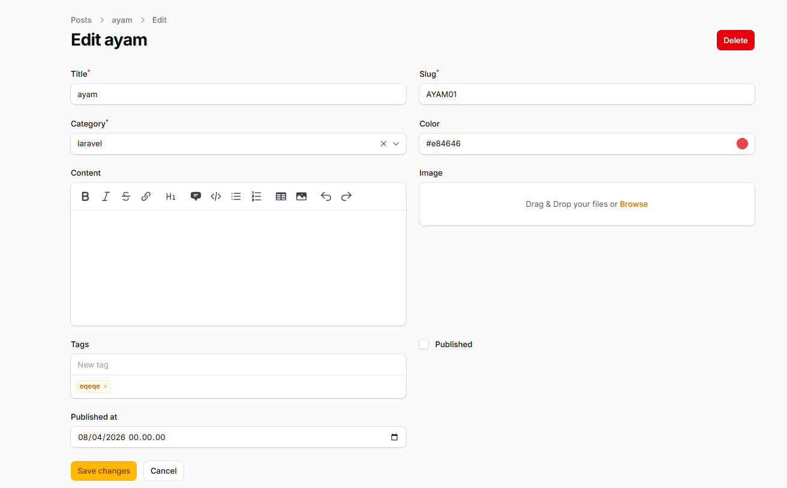
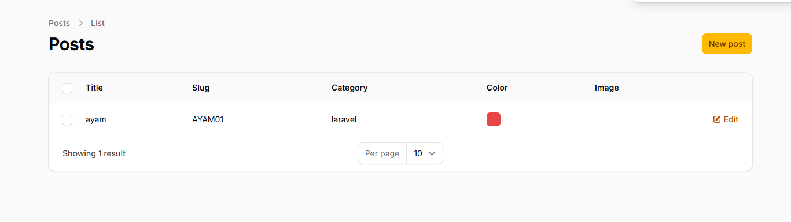

# Laporan Tugas Jobsheet 04 - Filament - PWL 2025/2026

## Analisis & Diskusi

### Pertanyaan

**1. Mengapa kita perlu `storage:link`**

File yang diupload secara default masuk ke `storage/app/public`. Folder ini diisolasi dan tidak bisa diakses langsung lewat URL oleh browser. Perintah ini membuat symlink ke folder `public/storage` agar aset seperti gambar bisa dirender di antarmuka web.

**2. Apa fungsi `$casts` untuk field JSON?**

Karena field seperti `tags` menggunakan format input berbentuk array, `$casts` secara otomatis:
- Mengubah string JSON dari database menjadi array PHP saat dipanggil
- Mengubah array tersebut kembali menjadi JSON saat disimpan ke database

Tanpa ini, akan terjadi error tipe data.

**3. Mengapa kita menggunakan `category.name` bukan `category_id`?**

- `category_id` hanya menampilkan angka foreign key yang tidak berguna bagi pengguna
- Menggunakan `category.name` memberitahu Filament untuk mengeksekusi relasi Eloquent (`belongsTo`) agar menampilkan nama kategori yang dapat dibaca manusia

**4. Apa perbedaan `RichEditor` dan `MarkdownEditor`?**

**RichEditor:**
- Menyediakan antarmuka WYSIWYG (What You See Is What You Get)
- Secara native menghasilkan tag HTML di latar belakang

**MarkdownEditor:**
- Mengharuskan input dengan format syntax Markdown (seperti `**bold**` atau `[link](url)`)
- Menyimpannya sebagai teks murni tanpa tag HTML

Pilihan bergantung pada bagaimana Anda ingin me-render data tersebut di front-end nanti.

## Tampilan

**Tampilan CRUD**
 

 

**Tampilan List**
 