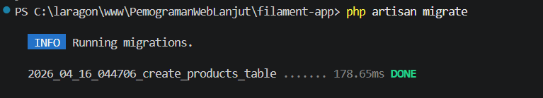
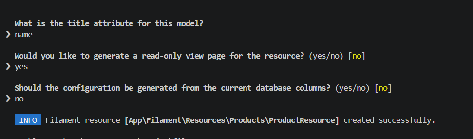
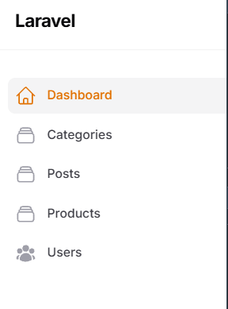
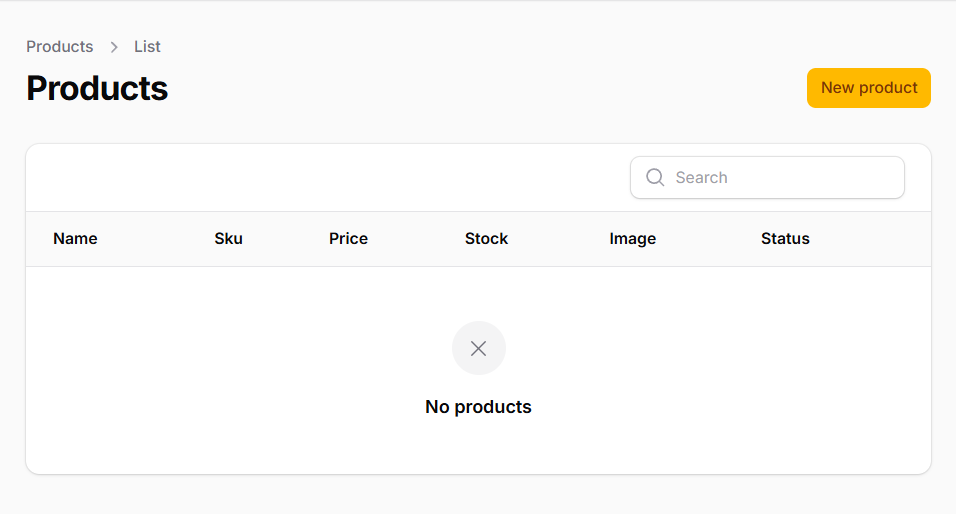
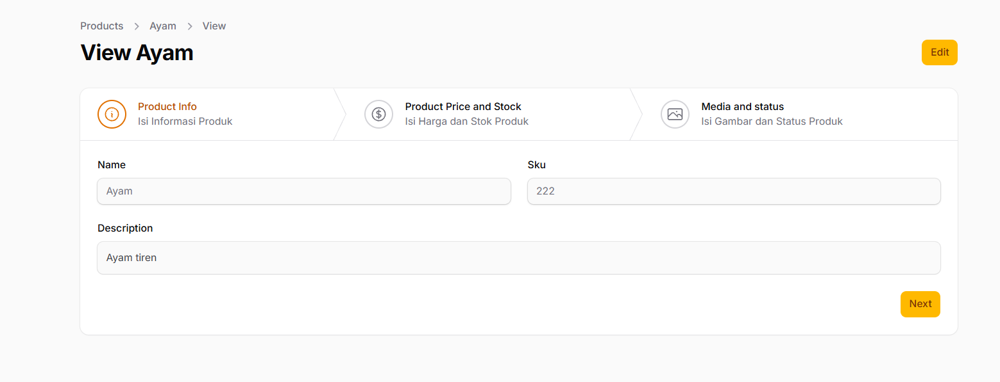
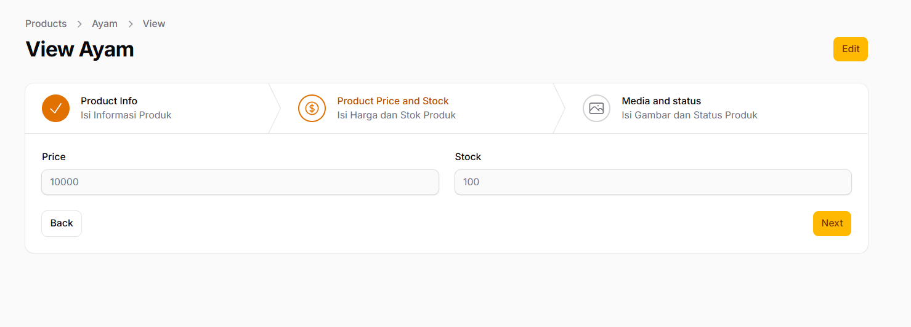
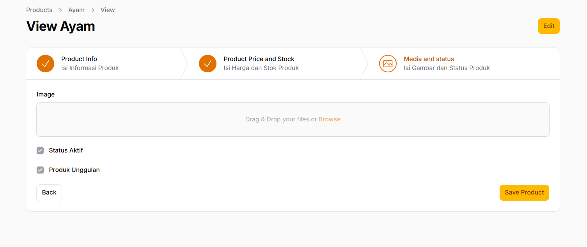
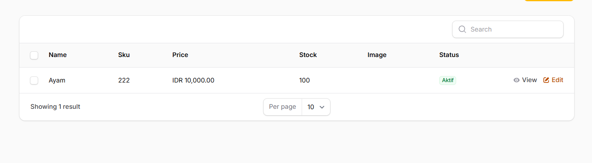

# LAPORAN PRAKTIKUM PEMROGRAMAN WEB LANJUT
## Pertemuan 7 - Implementasi Wizard Form (Multi Step Form) di Filament

### A. Studi Kasus

Dalam sistem e-commerce, form untuk memasukkan data produk biasanya sangat panjang dan kompleks. Untuk meningkatkan user experience (UX) dan membuatnya lebih user-friendly, form tersebut dibagi menjadi beberapa tahap menggunakan teknik Wizard Form (Multi Step Form). Tahapan yang dibuat meliputi:
- Product Info
- Pricing & Stock
- Media & Status

---

### B. Langkah-Langkah Praktikum

#### 1. Membuat Migrasi Database

Langkah pertama adalah membuat tabel products di database.

**Perintah:**
```bash
php artisan make:migration create_products_table
```

**Kode Migrasi** (database/migrations/2026_04_16_044706_create_products_table.php):
```php
use Illuminate\Database\Migrations\Migration;
use Illuminate\Database\Schema\Blueprint;
use Illuminate\Support\Facades\Schema;

return new class extends Migration
{
    public function up(): void
    {
        Schema::create('products', function (Blueprint ) {
            ->id();
            ->string('name');
            ->string('sku')->unique();
            ->text('description');
            ->integer('price');
            ->integer('stock');
            ->string('image')->nullable();
            ->boolean('is_active')->default(true);
            ->boolean('is_featured')->default(false);
            ->timestamps();
        });
    }

    public function down(): void
    {
        Schema::dropIfExists('products');
    }
};
```

> 📸 **SCREENSHOT:**
> 
> *Contoh: Screenshot terminal saat tulisan Migrating... Done muncul atau screenshot struktur tabel di phpMyAdmin/DBeaver.*

#### 2. Membuat Model Product

**Perintah:**
```bash
php artisan make:model Product
```

**Kode Model** (app/Models/Product.php):
```php
namespace App\Models;

use Illuminate\Database\Eloquent\Factories\HasFactory;
use Illuminate\Database\Eloquent\Model;

class Product extends Model
{
    use HasFactory;

    protected  = [
        'name', 'sku', 'description', 'price', 
        'stock', 'image', 'is_active', 'is_featured'
    ];

    protected  = [
        'is_active' => 'boolean',
        'is_featured' => 'boolean',
        'price' => 'integer',
        'stock' => 'integer',
    ];
}
```

#### 3. Membuat Resource Product di Filament

**Perintah:**
```bash
php artisan make:filament-resource Product
```

**Catatan saat prompt muncul:**
- Title attribute: 
ame
- Generate view page: yes
- Generate from database: 
o

> 📸 **SCREENSHOT:** 
> 
> 

#### 4. Implementasi Wizard Form & Validasi (Termasuk Tugas M)

Mengubah form default menjadi form multi-step. Di sini juga langsung diterapkan penyelesaian dari Tugas M (Menambahkan icon pada step dan validasi minimal harga > 0).

**Kode Form** (app/Filament/Admin/Resources/Products/Schemas/ProductForm.php):
```php
namespace App\Filament\Admin\Resources\Products\Schemas;

use Filament\Schemas\Schema;
use Filament\Schemas\Components\Wizard;
use Filament\Schemas\Components\Wizard\Step;
use Filament\Schemas\Components\Group;
use Filament\Forms\Components\MarkdownEditor;
use Filament\Forms\Components\TextInput;
use Filament\Forms\Components\FileUpload;
use Filament\Forms\Components\Checkbox;
use Filament\Actions\Action;

class ProductForm
{
    public static function configure(Schema ): Schema
    {
        return ->components([
            Wizard::make([
                Step::make('Product Info')
                    ->description('Isi informasi dasar produk')
                    ->icon('heroicon-o-information-circle') // Jawaban Tugas M.1
                    ->schema([
                        Group::make([
                            TextInput::make('name')->required(),
                            TextInput::make('sku')->required(),
                        ])->columns(2),
                        MarkdownEditor::make('description')->columnSpanFull(),
                    ]),

                Step::make('Pricing & Stock')
                    ->description('Isi harga dan jumlah stok')
                    ->icon('heroicon-o-currency-dollar') // Jawaban Tugas M.1
                    ->schema([
                        TextInput::make('price')
                            ->numeric()
                            ->required()
                            ->minValue(1), // Jawaban Tugas M.2: Minimal harga > 0

                        TextInput::make('stock')
                            ->numeric()
                            ->required(),
                    ]),

                Step::make('Media & Status')
                    ->description('Upload gambar dan atur status')
                    ->icon('heroicon-o-photo') // Jawaban Tugas M.1
                    ->schema([
                        FileUpload::make('image')
                            ->disk('public')
                            ->directory('products'),
                        Checkbox::make('is_active')->label('Is Active'),
                        Checkbox::make('is_featured')->label('Is Featured'),
                    ]),
            ])
            ->columnSpanFull()
            ->submitAction( // Pengaturan tombol submit pada Wizard
                Action::make('save')
                    ->label('Save Product')
                    ->button()
                    ->color('primary')
                    ->submit('save')
            )
        ]);
    }
}
```

> 📸 **SCREENSHOT:** 
> - **Product:** 
> - **Step 1:** 
> - **Step 2:** 
> - **Step 3:** 

#### 5. Menghilangkan Default Button

Karena kita sudah menggunakan tombol submit dari Wizard, tombol "Create" bawaan halaman harus dihilangkan agar tidak bingung.

**Kode Page** (app/Filament/Admin/Resources/Products/Pages/CreateProduct.php):
```php
namespace App\Filament\Admin\Resources\Products\Pages;

use App\Filament\Admin\Resources\Products\ProductResource;
use Filament\Resources\Pages\CreateRecord;

class CreateProduct extends CreateRecord
{
    protected static string  = ProductResource::class;

    // Override fungsi ini untuk mengembalikan array kosong
    protected function getFormActions(): array
    {
        return [];
    }
}
```

#### 6. Menampilkan Data pada Tabel (Termasuk Tugas M)

Menampilkan data yang telah diinput ke dalam tabel Filament. Ini termasuk Tugas M.3 (menambahkan badge pada kolom status aktif).

**Kode Table** (app/Filament/Admin/Resources/Products/Tables/ProductsTable.php):
```php
namespace App\Filament\Admin\Resources\Products\Tables;

use Filament\Tables\Table;
use Filament\Tables\Columns\ImageColumn;
use Filament\Tables\Columns\TextColumn;
use Filament\Actions\BulkActionGroup;
use Filament\Actions\DeleteBulkAction;
use Filament\Actions\EditAction;
use Filament\Actions\ViewAction;

class ProductsTable
{
    public static function configure(Table ): Table
    {
        return 
            ->columns([
                TextColumn::make('name')->searchable(),
                TextColumn::make('sku'),
                TextColumn::make('price')
                    ->money('IDR')
                    ->sortable(),
                TextColumn::make('stock'),
                ImageColumn::make('image')->disk('public'),
                
                // Jawaban Tugas M.3: Badge Kolom Status Aktif
                TextColumn::make('is_active')
                    ->label('Status')
                    ->badge()
                    ->formatStateUsing(fn (bool ): string =>  ? 'Aktif' : 'Non-Aktif')
                    ->color(fn (bool ): string =>  ? 'success' : 'danger'),
            ])
            ->recordActions([
                ViewAction::make(),
                EditAction::make(),
            ])
            ->bulkActions([
                BulkActionGroup::make([
                    DeleteBulkAction::make(),
                ]),
            ]);
    }
}
```

> 📸 **SCREENSHOT:** 
> 
> *Pastikan screenshot memperlihatkan badge status aktif dan gambar yang berhasil diupload.*

---

### C. Jawaban Analisis & Diskusi (Bagian L)

**1. Mengapa Wizard Form lebih baik untuk form panjang?**
Wizard Form memecah form yang panjang dan mengintimidasi menjadi beberapa potongan logis yang lebih kecil. Hal ini secara drastis mengurangi beban kognitif (*cognitive load*) pengguna. Pengguna dapat fokus pada satu konteks data pada satu waktu (misal: hanya memikirkan harga, sebelum memikirkan foto produk), sehingga mengurangi kemungkinan kesalahan input dan meningkatkan rasio penyelesaian pengisian form.

**2. Kapan kita menggunakan skippable()?**
Fungsi skippable() digunakan ketika sebuah tahapan (step) dalam wizard memuat informasi yang bersifat opsional atau tidak wajib diisi saat itu juga. Dengan skippable(), sistem mengizinkan pengguna untuk melewati langkah tersebut tanpa memicu error validasi form, sehingga mereka bisa langsung menuju langkah akhir atau submit.

**3. Apa kelebihan multi step dibanding single form panjang?**
- **Fokus Visual:** Tampilan tidak terlihat penuh sesak.
- **Organisasi Data:** Data dikelompokkan secara logis, memudahkan pemahaman alur.
- **Validasi Berkala:** Validasi dilakukan per langkah, sehingga pengguna langsung tahu jika ada error sebelum mereka tersesat di tumpukan form.
- **Progress Indication:** Adanya indikator visual (Step 1, 2, 3) memberikan efek psikologis bahwa tugas ini terukur dan akan segera selesai.

**4. Apakah wizard cocok untuk semua jenis form?**
**Tidak.** Wizard form sangat buruk jika digunakan untuk form yang sederhana dan pendek (seperti form Login, form Contact Us, atau input yang hanya butuh 2-3 kolom). Memaksa form pendek menjadi wizard hanya akan membuang waktu pengguna karena harus melakukan klik tambahan secara sia-sia. Wizard hanya cocok untuk entitas data kompleks yang membutuhkan kategorisasi masif.

---
*Selesai.*
