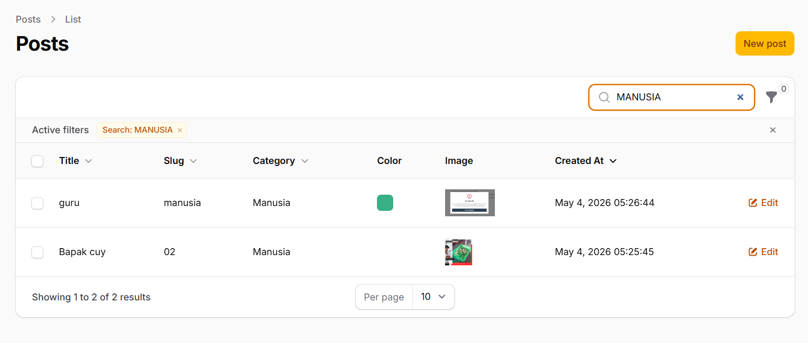
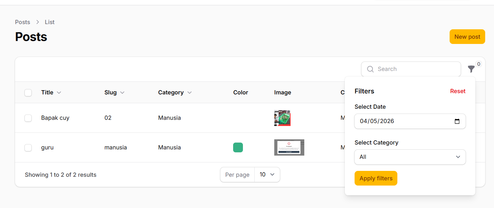
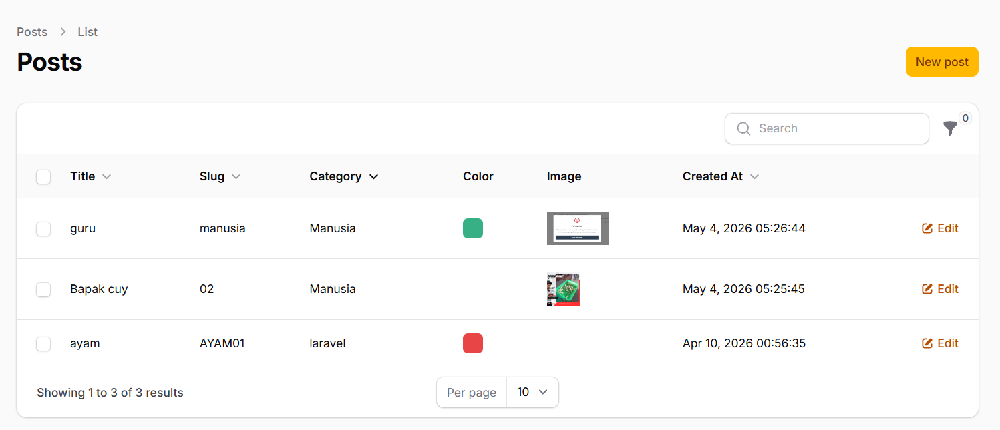

# Laporan Praktikum Pertemuan 11: Implementasi Search & Filter pada Table Filament

**Mata Kuliah:** Pemrograman Web Lanjut  
**Nama Mahasiswa:** [Nama Anda]  
**NIM:** [NIM Anda]  

---

## 1. Implementasi Global Search pada Kolom Text
Menambahkan method `searchable()` pada kolom `title`, `slug`, dan relasi `category.name` agar user dapat mencari data secara real-time.

**Langkah Kerja:**
Buka file `app/Filament/Resources/Posts/Tables/PostsTable.php` dan modifikasi bagian `columns`:

```php
TextColumn::make('title')->sortable()->searchable(),
TextColumn::make('slug')->sortable()->searchable(),
TextColumn::make('category.name')->sortable()->searchable(),
```

**Hasil:**

*Keterangan: Input pencarian akan muncul di pojok kanan atas tabel.*

---

## 2. Membuat Filter Berdasarkan Tanggal (Date Filter)
Menggunakan `Filter::make` dikombinasikan dengan `DatePicker` untuk memfilter data berdasarkan hari tertentu.

**Langkah Kerja:**
Tambahkan kode berikut pada bagian `filters()`:

```php
Filter::make('created_at')
    ->label('Creation Date')
    ->schema([
        DatePicker::make('created_at')
            ->label('Select Date'),
    ])
    ->query(function ($query, $data) {
        return $query->when(
            $data['created_at'],
            fn ($query, $date) => $query->whereDate('created_at', $date)
        );
    }),
```

**Hasil:**

*Keterangan: Pengguna dapat memilih tanggal spesifik untuk menampilkan post.*

---

## 3. Membuat Filter Berdasarkan Kategori (Select Filter)
Mempermudah pengelompokan data berdasarkan kategori menggunakan dropdown.

**Langkah Kerja:**
Tambahkan `SelectFilter` pada bagian `filters()`:

```php
SelectFilter::make('category_id')
    ->label('Select Category')
    ->relationship('category', 'name')
    ->preload(),
```

**Hasil:**

*Keterangan: Dropdown kategori yang sudah terisi data (preload) untuk memudahkan pemilihan.*

---

## Analisis & Diskusi

1. **Mengapa search tidak cocok untuk filter tanggal?**  
   Search biasanya bekerja dengan pencarian teks menggunakan operator `LIKE %query%`. Untuk tanggal, format penyimpanan di database seringkali berbeda dengan input user (Y-m-d H:i:s), sehingga lebih akurat menggunakan `whereDate()` agar perbandingan hari, bulan, dan tahun tepat.

2. **Apa fungsi relationship() pada SelectFilter?**  
   Fungsi ini memberitahu Filament untuk mengambil opsi dropdown langsung dari tabel relasi (dalam hal ini tabel `categories`). Kita tidak perlu menulis query manual untuk mengambil daftar kategori.

3. **Mengapa kita perlu whereDate() pada query filter?**  
   Karena kolom `created_at` bertipe **timestamp** (berisi tanggal dan jam), sedangkan input dari `DatePicker` hanya berupa **tanggal**. `whereDate()` mengabaikan bagian jam sehingga data tetap cocok meskipun jamnya berbeda.

4. **Apa perbedaan searchable() dan filters()?**  
   `searchable()` digunakan untuk pencarian teks global yang cepat, sedangkan `filters()` digunakan untuk penyaringan data yang lebih terstruktur dan kompleks (seperti range angka, pilihan kategori, atau range tanggal).

---

## Kesimpulan
Pada praktikum ini, fitur Search dan Filter telah berhasil diintegrasikan ke dalam tabel Admin. Hal ini membuat aplikasi lebih skalabel dan memudahkan pengguna dalam mengelola ribuan data post dengan cepat dan akurat.
