

## Profil
Nama : Nabhan Rizqi Julian Saputro
Kelas : 2F-TI
Nim : 2341720255
---

## Praktikum 1
- 1)
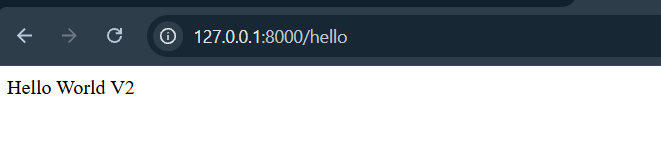
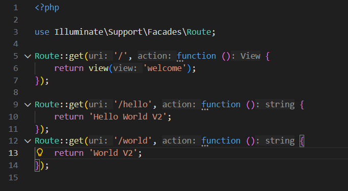

---

- 2)
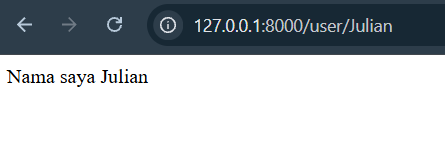
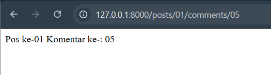
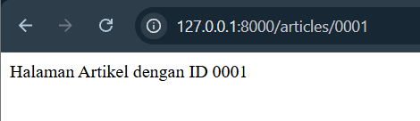
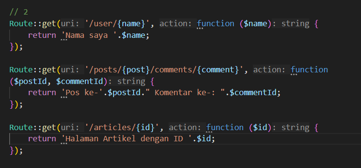

---

- 3)
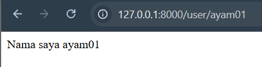
Akan menampilkan (kosong) jika parameter tidak di isi dan menampilkan jika parameter di isi

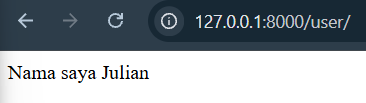
Akan menampilkan nilai default jika parameter tidak di isi

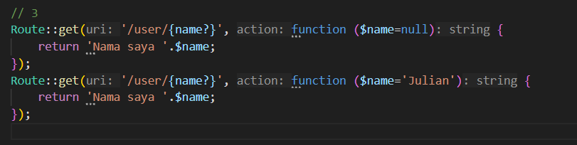
Kode dari Hasil diatas

---

## Praktikum 2 
- 1)
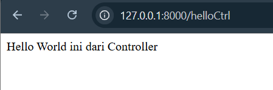
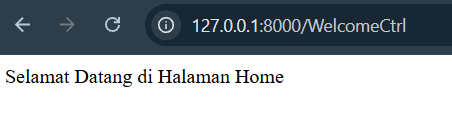
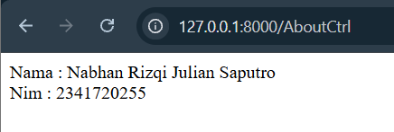
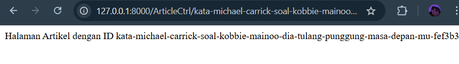
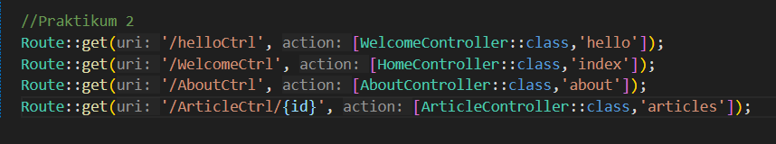
---

- 2)
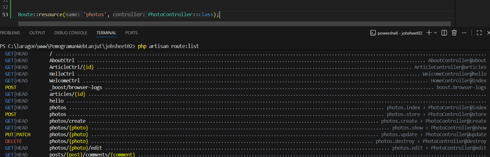
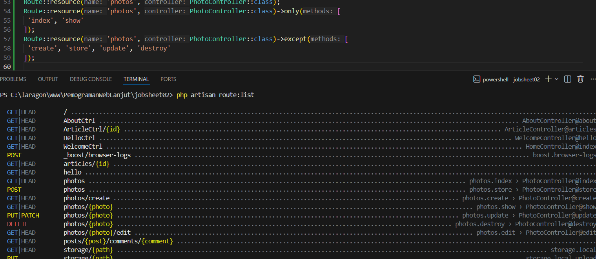

## Praktikum 3
- 1)
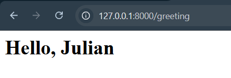
---

- 2)

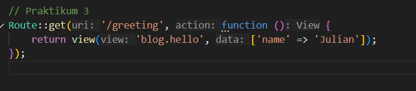

- 3)
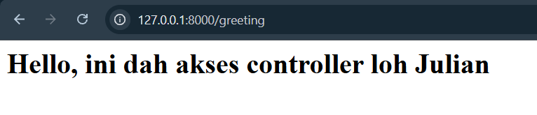

- 4)
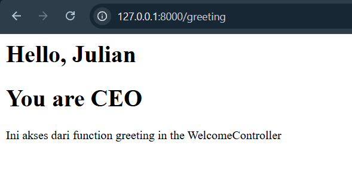

---

## Tugas Jobsheet 2
Akses : [POS](https://github.com/rzjuliannofficial/PemogramanWebLanjut/tree/ae7ab880010031d2906a9ee979893303815a7f2e/POS_tugas_jobsheet02)